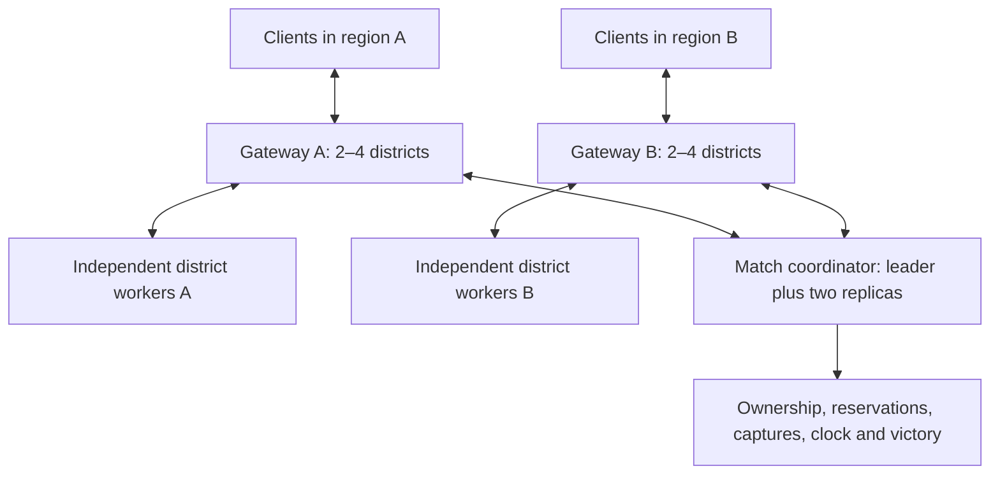

# CQ interconnected districts and distributed master study

The opt-in [persistent cluster implementation](PERSISTENT-DISTRICT-CLUSTER.md) now provides regional gateways, replicated coordination and dynamic 4–64 district membership. Its separate protocol and validation limits are documented there.

Study date: 2026-09-20. Experimental source baseline: `78bd56a`. This report adds measurements and a proposed architecture; it does not implement a distributed master or raise game limits. Raw results and binary/pack hashes are in [the receipt](validation/cq-distributed-master-study.json).

## Conclusions

The executable currently supports **16 district workers, 64 connected players globally and 16 reservations per district**. Sixteen workers therefore do not currently allow 256 connected players. Raising a configuration ceiling alone would overload the current public master under concentrated human-client traffic.

A distributed master is feasible as **regional traffic gateways plus a replicated match coordinator**. Start with two full districts per gateway; four is a candidate after shared encoding, scheduling and real network validation. A three-node coordinator can retain one authoritative match while gateways and workers scale independently. Replicating today's entire master would preserve its serialization bottleneck.

There is no measured, hardware-independent maximum beyond today's hard limits. A sensible next scale target is **32–64 districts / 512–1,024 active slots**, after proving the architecture on the existing sixteen maps. Hundreds or thousands of districts are architectural possibilities, not supported capacities. They require topology, admission, roster, failure handling and coordinator changes described below.

| District workers | Maximum active slots at 16 each | Illustrative target at 14 each | Gateways at 4 districts each | Status |
|---:|---:|---:|---:|---|
| 16 | 256 | 224 | 4 | Existing map count; current global admission still 64 |
| 64 | 1,024 | 896 | 16 | Proposed next scale target |
| 256 | 4,096 | 3,584 | 64 | Untested larger architecture |
| 1,024 | 16,384 | 14,336 | 256 | Conditional planning scenario only |

Two districts per gateway doubles gateway counts. Gateways are processes/shards, not necessarily separate physical machines. Worker CPU, memory and network capacity still have to be provisioned independently.

## Capacity includes travel and respawning

For D districts, the upper bound is 16D active actors, **less any capacity consumed by duplicate source/destination reservations during transfers**. It is not a useful steady-state target: when every district is full, every destination gate is closed. Reserving two spare slots per district is an illustrative deployment policy, not an implemented reduction of the 16-player limit. An average of fourteen does not guarantee room in a particular destination.

A dead resident retains its original slot initially and may reuse it for a friendly same-district respawn even at 16/16. A respawn elsewhere must reserve a destination. If there is no friendly slot, the player moves to the private reinforcement waiting room, freeing the worker slot. Waiting players still consume a public connection, identity, queue entry and the current global 64-player allowance. Consequently, total connected clients can exceed active slots only with a separately budgeted waiting population; no unlimited waiting population is implied.

The distributed design must preserve atomic admission, nearest-friendly-district selection, absent-team capture reset, contested capture pause, and homebase perimeter prerequisites. Simultaneous respawns and transfers must compete for the same reservations. Indexed queues should wake on capacity/control changes, with deterministic fairness, rather than scanning every waiting actor against every owner each frame.

## Fresh master measurements

Reference host: Intel i7-12700, 62 GiB RAM, Godot 4.7.2 console runtime. Each benchmark was pinned to CPUs 8 and 9, one performance core and its SMT sibling. Other applications and the local sixteen-worker session remained running. These are not isolated-hardware measurements, and changes from the older [scalability report](CQ-SCALABILITY.md) cannot be attributed solely to code regression.

Each logical district contains sixteen synthetic human recipients and thirty-two rocket records. Each case has twenty measured snapshot batches after five warmups, repeated twice. The harness exercises current snapshot construction/scoping/encoding, worker-state application, input forwarding serialization and capture rules. It uses legacy city metadata, not actual split-map physics. Cases exceeding 64 actors bypass admission only inside the fixture.

| Full districts | Current replication mean | Current replication p95 | Modeled component core usage |
|---:|---:|---:|---:|
| 1 | 25.33–25.38 ms | 28.97 ms | 56.0–56.1% |
| 2 | 53.08–53.50 ms | 59.21–60.81 ms | 116.4–117.2% |
| 4 | 114.27–116.46 ms | 129.06–129.38 ms | 247.7–252.1% |
| 8 | 271.76–276.32 ms | 304.27–315.81 ms | 581.8–590.6% |
| 16 | 743.67–762.94 ms | 831.37–1,093.65 ms | 1,565.5–1,602.8% |

Two full districts already exceed the 50 ms interval between 20 Hz snapshots on this core. Even one full district produces a burst longer than a 16.67 ms physics tick. This does not certify one full district as perfectly smooth. Sixty-four bots with one viewing client do not substitute for sixty-four human connections: bots do not incur public snapshot delivery for themselves.

The existing **benchmark-only shared encoder** scopes and encodes once per district, then accounts for each recipient. It is not production code:

| Full districts | Shared replication mean | Shared replication p95 | Modeled component core usage |
|---:|---:|---:|---:|
| 1 | 2.02–2.18 ms | 2.21–3.23 ms | 10.3–10.6% |
| 2 | 3.94–4.03 ms | 4.37–4.44 ms | 17.9–18.5% |
| 4 | 8.28–9.39 ms | 8.92–13.92 ms | 35.0–38.7% |
| 8 | 19.12–19.28 ms | 20.74–20.88 ms | 74.9–76.0% |
| 16 | 50.52–52.14 ms | 55.73–58.99 ms | 177.3–182.1% |

Four districts offer a plausible average CPU budget, but ingress plus replication can still make a long main-thread burst. Two to four full districts per gateway is therefore a provisional planning range, conditional on implementing shared encoding and bounded scheduling. Eight leaves too little headroom in this workload.

Component CPU is calculated as:

```text
percent of one core = [20 × (replication_ms + worker_ingress_ms)
                      + 30 × input_batch_ms + 60 × capture_tick_ms] / 10
```

It excludes sockets, actual public delivery, voice, full-body/face tracking, admission, roster fanout, capacity broadcasts, transfers, ownership checks, polling, waiting queues and consensus. It is a lower-bound model, not measured whole-process utilization. Twenty samples cannot establish reliable p99 behavior. The earlier worker physics result of 6.14–6.32 ms p95 at sixteen combatants predates the current decorated split maps; no fresh sixteen-combatant-per-map physics certification was performed here.

## Network scaling

This synthetic workload serialized approximately **12.0 Mbit/s per full district privately** and **4.57 Mbit/s per full district publicly**, at 20 Hz. Shared encoding saves CPU, not recipient bandwidth. These figures exclude transport/tunnel overhead, voice, assets and richer tracking; static synthetic ordnance is not a worst-case firefight.

| Districts | Aggregate worker → gateway | Aggregate gateway → clients |
|---:|---:|---:|
| 16 | 192 Mbit/s | 73 Mbit/s |
| 64 | 768 Mbit/s | 292 Mbit/s |
| 256 | 3.07 Gbit/s | 1.17 Gbit/s |
| 1,024 | 12.29 Gbit/s | 4.68 Gbit/s |

These are distributed aggregate link budgets, not traffic that should pass through the coordinator. Current routine private snapshots carry more state than clients need; separating routine replication from complete migration payloads is another optimization opportunity.

For a rectangular grid, adjacency edges number 2D − width − height. A 32×32 world has 1,984 neighbor links, not a full mesh. Local-plus-neighbor radio has at most 79 other raw recipients with sixteen actors in each of five districts, before team filtering. Indexing those subscriptions keeps its routing work local; the current relay still scans the global player list.

## Limits to remove before increasing the world

| Area | Current constraint or cost | Required change |
|---|---|---|
| `server/config.gd`, `conquest/rules.gd`, `conquest/capacity.gd` | 16 workers, 64 clients, fixed 4×4 coordinates and sixteen-entry arrays | Manifest-defined graph and separate active/waiting admission budgets |
| `conquest/district_maps.gd`, client map validation | Exactly sixteen maps; client checks all map/presentation assets | Versioned catalog, local coordinates/portal transforms, lazy acquisition and neighbor prefetch |
| CQ capture rules | Four fixed corner homebases and fixed perimeter lists | Explicit larger-world homebase/perimeter and deployment definitions |
| `server/districts/gateway.gd`, `network/replication.gd` | Global deep copy/filter per recipient and repeated district encoding | District-indexed state, shared stream with per-client baselines/generations and loss recovery |
| `arena.gd` roster handling | Global roster creates a fighter for every player, even remote hidden players | Local actor roster plus lightweight, paged global scoreboard |
| Gateway progress, capacity and heartbeat | Per-frame owner/waiter scans; global capacity/rules sent to all workers | Indexed event queues, local subscriptions and deltas; avoid quadratic metadata fanout |
| `server/districts/external.gd` | 16 KiB inventory file limit, fixed district ID validation | Bounded paged inventory/discovery and stable district identities |
| Codecs and worker wire | Public packet limits, private 1 MiB message / 2 MiB queue bounds | Chunk catalogs/rosters; preserve bounded messages, queue age and overload behavior |
| Worker projectile identity | District-based numeric block with finite local counter | Stable identity including district, worker incarnation and counter |
| Gateway failure/round handling | A stale worker can pause or terminate the entire match; reset waits for all | Regional failure containment and explicit match-clock/reset policy |

The current pretty-printed inventory reaches 16,428 bytes at 82 workers; this is a secondary obstacle if the sixteen-worker validation is removed, not an 82-worker supported capacity. The codec already supports 64-bit integers, so projectile IDs do not imply an immediate 32-bit district ceiling.

Godot documents at most 4,095 peers per ENet server host. Four thousand ninety-six full-district clients would already require multiple hosts, independent of CPU limitations. This is a per-host API bound, not a cluster-wide limit ([Godot ENetMultiplayerPeer](https://docs.godotengine.org/en/stable/classes/class_enetmultiplayerpeer.html)). The existing 4 MiB/s asset bandwidth budget is not a gameplay bandwidth limiter: gameplay is accounted as a reserve rather than delayed to that cap.

## Proposed distributed master



Gateways handle ENet sessions, inputs, snapshots, scoped rosters and district radio. Workers retain local movement/combat/AI. The coordinator handles authoritative district assignment, actor ownership, admission/reservation transactions, capture commits, waiting deployment and match progression. Movement snapshots and voice never enter its durable consensus log.

Use an established consensus service such as a three-member etcd cluster for durable coordination, with CQ application logic above it. Three voting members tolerate one failure; five tolerate two, with additional replication cost. Adding replicas improves fault tolerance rather than multiplying write throughput ([etcd FAQ](https://etcd.io/docs/v3.6/faq/)). Keep the initial quorum in a low-latency region: commit latency depends on network round trips and durable disk writes ([etcd performance](https://etcd.io/docs/v3.6/op-guide/performance/)). This is an architectural recommendation, not an etcd integration already present in the game.

District authorities should report ordered capture-circle entry/exit changes and bounded progress checkpoints instead of every actor's position at 60 Hz. A proposed once-per-second checkpoint is not permission to sample circle presence only once per second: brief absence must still reset progress, contested periods must pause it, and homebase capture must be committed against current perimeter ownership. Match epochs and monotonic time bounds must make retries deterministic.

For much larger worlds, regional coordinators could each have their own quorum and ownership shard, with a small global match authority. That genuinely distributes writes, but introduces cross-region transactions. It should follow measurement of the simpler single logical coordinator. Independent matches are easier to scale but do not form one interconnected CQ world.

### Ownership handoff and failure safety

1. Give each actor a global identity distinct from its ENet peer ID. Commands carry match epoch, ownership generation, worker incarnation and authority fencing token.
2. Atomically reserve destination capacity, counting incoming, resident and rollback reservations against sixteen. Freeze/escrow the source's validated migration state, including health, ammunition, prediction and jetpack state.
3. Prepare the destination and client baseline, then durably commit a unique transfer decision. Only the committed generation activates; source release and all retries are idempotent.
4. Recover an interrupted transfer from the committed decision. Reject stale leaders and duplicate/out-of-order messages. An uncertain transfer holds its reservations until resolved; it must not create two active copies or silently lose the actor.

Reservation timeout alone cannot revoke a still-running old worker. Lease expiry needs fencing and explicit clock/expiry assumptions before another owner activates. Leader election also does not restore ENet sequence/channel state: keep sessions at gateways, and provide reconnect tickets and a fresh baseline after gateway failure.

On quorum loss, block new admissions, transfers, respawns and capture commits. Existing local combat may continue only while its authority lease remains valid, then freeze. Define and record how the match clock handles the interruption. A minority partition cannot safely continue authoritative writes ([etcd failure behavior](https://etcd.io/docs/v3.6/op-guide/failures/)). Worker simulation recovery is a separate problem: coordinator replication alone cannot reconstruct uncheckpointed combat. Define an acceptable recovery window or move affected actors to waiting deployment rather than guessing state.

## Conditional coordinator budget

[The calculator](../tools/cq_gateway/cluster_capacity.py) is arithmetic, not a cluster benchmark. Its default assumptions are deliberately exposed:

- Assumed sustainable coordinator rate: 5,000 commands/s, with only 50% allocated to this model. This is **not measured CQ or etcd throughput**.
- One capture/progress checkpoint per district per second and one regional lease renewal per four-district gateway per second.
- Four committed control records per transfer. Every active player crosses once per sixty seconds normally, or once per five seconds in the burst scenario.
- Join/death events, retries, waiting-room deployment and other work need the remaining budget or a richer model. Transaction size, quorum durability and subscription fanout must be measured.

```text
modeled commands/s = D + ceil(D / 4) + (16D / crossing_seconds) × 4
```

| Districts | Normal commands/s | Five-second crossing burst commands/s |
|---:|---:|---:|
| 16 | 37 | 225 |
| 64 | 148 | 899 |
| 256 | 593 | 3,597 |
| 1,024 | 2,372 | 14,387 |

Under those assumptions, the allocated 2,500-command budget fits **1,079 districts normally but only 177 during the crossing burst**. Neither number is a game capacity claim. It illustrates why a single lightweight coordinator could manage substantial district metadata while rapid migration, failed transfers or a reinforcement storm becomes its limiting workload. The existing bot route can repeatedly cross the same gate; prior local transfer counts therefore require scrutiny rather than being treated as normal strategic play.

## Validation path and reproduction

First implement shared encoding, indexed rosters/state and bounded snapshot scheduling on the existing topology. Then prototype two-to-four-district gateways and a three-node coordinator on the existing sixteen maps. Validate more human-equivalent connections before growing the map catalog. Generalize the manifest and CQ rules next; aim for 32–64 districts before considering 256 or 1,024.

Use actual ENet clients, separate hosts, realistic CPU contention, packet delay/loss, sixteen combatants per worker, projectiles, XR tracking and radio. Exercise waiting-room storms and gate churn. Measure worker/gateway p95 and p99, snapshot age, queue age and transfer interruption, not merely average CPU. Retain substantial CPU headroom and verify that main-thread bursts do not defeat the 60 Hz schedule.

Kill the coordinator leader, isolate a minority, stall a worker, lose a gateway and crash between every prepare/commit stage. Assert no district exceeds sixteen reservations, every actor has one authority, retries preserve inventory/jetpack state, waiting deployment remains fair, and capture/timeout yields exactly one result. Current global worker-failure behavior must be replaced before such a cluster can provide regional availability.

Fresh benchmark commands, using the current packaged runtime whose hashes appear in the receipt:

```sh
python3 tools/cq_gateway/scalability.py \
  --binary Builds/CQVulkanPolicy/FPSloppaServer.x86_64 \
  --name districts16-current --suite master --districts 1 2 4 8 16 \
  --players 16 --ordnance 32 --iterations 20 --repeat 2
python3 tools/cq_gateway/scalability.py \
  --binary Builds/CQVulkanPolicy/FPSloppaServer.x86_64 \
  --name districts16-shared --suite master --districts 1 2 4 8 16 \
  --players 16 --ordnance 32 --iterations 20 --repeat 2 --shared
python3 tools/cq_gateway/cluster_capacity.py
```

All twenty benchmark cases completed. The conditional calculator and receipts were validated separately. No distributed quorum, production shared encoder or multi-host capacity test was implemented by this study; no live server configuration was changed.
