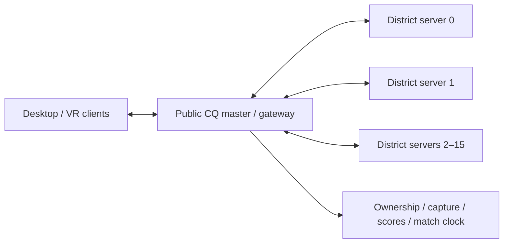

# CQ districts on separate server instances

The experimental branch now includes an opt-in external-worker prototype. One public master owns the match; each district runs in a separate dedicated-server process, which can be placed on another host. The client connection and CQ client protocol stay unchanged.

This is a feasibility prototype, not a production cluster or a new published release. The measurements below use independent local processes and a bounded TCP delay bridge. No remote testing service was restarted, and `main` was not modified.

## Single-master model



The master is the sole authority for admission, teams, actor-to-district ownership, transfer generations, capture circles, perimeter/homebase prerequisites, scoring, victory, timeout, radio routing and round reset. It receives worker state and builds client-specific replication. Workers own movement, combat, projectiles, pickups and AI within their district. They receive global rules from the master and do not advance global capture independently.

A transfer goes source → master → destination. The source escrows the actor; the master advances the generation, waits for destination preparation and client readiness, commits the destination, releases the source and sends the client a fresh baseline. Direct worker-to-worker connections are unnecessary. A master-driven reset waits for every participating worker's epoch acknowledgment before readmitting actors.

The master does not need to run every physics simulation or force all workers into per-frame lockstep. Its global match clock is authoritative, while workers retain local physics clocks and rebase transferred deadlines. This has limits over slow links: the current timestamp mapping and lag-compensation allowance were designed for local workers. Clock-offset/RTT estimation, snapshot sample-age handling and combat rewind need dedicated tests before treating geographically distant workers as equivalent.

## What the prototype changes

- `--cq-external-workers <master.json>` selects a fixed, prestarted worker inventory. It requires the existing CQ-only `sv_cq_backend districts` setting. Without this flag, local on-demand workers continue to work as before.
- The master accepts a configured district, random per-worker credential, random instance identity, per-master session identity, private link protocol, matching release version, map SHA and transfer schema. Duplicate district connections and wrong identities are rejected. The remote PID is diagnostic data; it is never passed to a local process-control call.
- `--worker-session-file <worker-N.json>` starts the same dedicated executable independently. Credentials are read from private files instead of command-line arguments. The generator creates files with mode 0600 and refuses to overwrite a provisioned session.
- All private listeners remain bound to loopback. For separate hosts, an SSH tunnel connects each worker host's loopback endpoint to the master's loopback listener. The prototype does not expose its Variant message transport directly to the Internet.
- All configured workers connect before use and remain resident. There is no local eviction/relaunch policy for external workers. A district missing from the provisioned inventory fails the match when requested. For a complete city, provision all 16 districts; the worker limit remains independent of CQ's 64-player admission ceiling.
- Authenticated RCON status includes worker placement, per-link byte counters and snapshot age.

The four-worker/two-client checks exercise real gateway admission, movement prediction, two crossings per client, events, visibility filtering, stale-generation rejection and master-driven round restart. Separate fixtures check identity/configuration rejection. The failure test kills an independently launched worker and requires the master to exit with code 3 and the other workers to stop on connection loss.

## Measured feasibility (2026-09-20)

Four independent district processes, one master and two real prediction clients completed all four runs. Each client crossed two district boundaries, received events, rejected obsolete generations and survived a master-driven round reset. The master match clock advanced in every run. Killing one external worker stopped the master with exit code 3 and disconnected the remaining workers as intended.

| Added master–worker RTT | Observed handoff pause | Maximum prediction error | Hard prediction resets | Aggregate private traffic |
| --- | --- | --- | --- | --- |
| 0 ms | 68–134 ms | 0.313 m | 0 | 2.21 Mbit/s |
| 30 ms | 134–200 ms | 0.313 m | 0 | 2.21 Mbit/s |
| 100 ms | 267–334 ms | 0.280 m | 0 | 2.19 Mbit/s |
| 250 ms | 600–602 ms | 0.313 m | 0 | 2.18 Mbit/s |

Each row is one run, with four measured crossings and roughly 44–46 seconds of client activity. The client samples pauses approximately every 50–67 ms. Handoff pauses run from the client's transition notice to its new baseline; they exclude latency before that notice arrives. Prediction error is the maximum reported by the route probe, not a visual smoothness assessment. Traffic adds both directions across all four private links, excluding TCP/SSH overhead; it is not a 64-player bandwidth estimate.

All runs passed the authority/replication assertions, but the approximately 600 ms handoff at 250 ms RTT is a noticeable interruption. This supports a low-latency worker network as the next deployment target. Independent configuration/identity fixtures passed 23 checks, private worker protocol fixtures passed 47, and CQ rules passed 221. The default local backend also passed four transfers across three districts with a two-worker limit, including eviction/relaunch and a round reset. Godot reported ObjectDB/resource-in-use warnings during fixture/client shutdown; gameplay assertions passed and the test processes were reaped.

Raw measurements and scope limits are recorded in [the validation receipt](validation/cq-external-workers.json). These are same-machine delay-injection results, not physical multi-host, combat-under-lag or 64-player performance validation.

## Running across hosts

Build the same experimental checkout on the master and worker machines, or copy the same console-only package to each. The initial prototype requires matching release versions as well as the private protocol, schema and map hash; deploy the same binary/PCK because a version string is not a content digest.

Generate a fresh inventory for every master lifetime:

```sh
python3 tools/cq_gateway/external_config.py --output /private/cq-session --port 39000
```

Keep `master.json` on the master. Copy only `worker-N.json` to the host responsible for district N. The default creates all 16 districts; `--zones 0 1 2 3` is useful for the bounded test routes, not a complete playable city. Set these in the master's CQ config:

```cfg
set sv_cq_backend districts
set sv_cq_worker_limit 16
```

Start the master first:

```sh
./FPSloppaServer.x86_64 -- --experimental-cq \
  --config /private/conquest.cfg \
  --cq-external-workers /private/cq-session/master.json
```

On each worker host, establish one tunnel to the master and then start the district process:

```sh
ssh -NT -o StrictHostKeyChecking=yes -o ExitOnForwardFailure=yes \
  -o ServerAliveInterval=5 -o ServerAliveCountMax=2 \
  -L 127.0.0.1:39000:127.0.0.1:39000 cq@MASTER_HOST

./FPSloppaServer.x86_64 -- --experimental-cq --cq-worker 0 \
  --worker-session-file /private/cq-session/worker-0.json
```

The tunnel runs as a separate service/terminal. Several district processes on one worker host can share that tunnel, while each retains its own credential and instance ID. Start all configured workers within the existing 60-second startup deadline. Supervisors should stop the whole session after failure and create fresh session files before restart; reconnecting a replacement into an active match is not implemented.

OpenSSH documents encrypted TCP forwarding with `-L` and explicit loopback binding in its [ssh manual](https://man.openbsd.org/ssh.1). `ExitOnForwardFailure` checks forwarding setup, not the health of the eventual destination; the application heartbeat remains necessary ([ssh_config](https://man.openbsd.org/ssh_config)). Native TLS could replace tunnels later: Godot provides [StreamPeerTLS](https://docs.godotengine.org/en/stable/classes/class_streampeertls.html), but the current wire implementation is specifically typed to `StreamPeerTCP` and would need a transport abstraction and certificate provisioning.

## Practical limits and next steps

The sensible initial deployment is one low-latency site: a master plus one or more worker hosts, each running several district instances. One worker per district does not require one physical machine per district. Full-city static collision remains loaded in each worker, and bot navigation is built lazily; district distribution does not yet reduce each instance's static memory footprint.

The master remains a bandwidth/serialization bottleneck and a single point of failure. Worker snapshots currently serialize full actor state at roughly 20 Hz, including fields only required for migration, and use an ordered TCP stream. Snapshot deltas, separating migration state from routine updates, and queue-age limits are worthwhile before scaling the worker fleet. TCP retransmission can delay newer snapshots behind older bytes. The delay test does not model packet loss, jitter, bandwidth caps, congestion or SSH encryption cost.

A failed or stale worker currently stops the entire match. Recovery would need durable master checkpoints, worker leases/fencing across master restarts, idempotent transfer receipts that survive process death, and an explicit policy for actors/pickups/projectiles in the lost district. A replacement must never take ownership while an old worker can still simulate it. Cross-district ballistics and cross-boundary actor collision are still not supported.

The next deployment test should put the master and workers on at least two physical machines, compare private LAN/tunnel links, then run populated districts and measure master CPU, link throughput, worker memory, capture timing and prediction error. A 64-player distributed performance claim requires that test; the present two-client route checks do not establish it.

## Reproduction

```sh
python3 tools/build_console_server.py --template /path/to/console-template \
  --cq-assets --output Builds/CQExternal
godot --headless --xr-mode off --path . --script tools/cq_gateway/external_rules.gd
python3 tools/cq_gateway/external_test.py --name external-final0 --latency-ms 0 --failure
python3 tools/cq_gateway/external_test.py --name external-final30 --latency-ms 30
python3 tools/cq_gateway/external_test.py --name external-final100 --latency-ms 100
python3 tools/cq_gateway/external_test.py --name external-final250 --latency-ms 250
```

Each run uses independent process groups and cleans them up. Private session files and logs remain under ignored `test-results/cq-gateway/`. The dedicated executable in the published 0.15v CQ prerelease predates this option; rebuild this checkout to use it.

## District capacity and reinforcement waiting rooms

The district backend now reserves at most 16 player slots in each district. Incoming gates close at capacity; source reservations remain until transfers commit, so a contested last slot can safely roll back. Respawns reuse the player's own friendly slot or reserve the nearest controlled district with room. When no such district exists, a private client-local waiting room replaces the battle actor until automatic deployment becomes possible. Waiting players retain their match identity and count toward the global 64-player admission limit.

This requires matching rebuilt CQ clients/master/workers: public protocol `fpsloppa-cq-experimental-3`, private protocol `cq-external-worker-2`, actor schema 3. The older published CQ prerelease is incompatible. Normal main-branch behavior remains unchanged.

See [CQ scalability measurements](CQ-SCALABILITY.md) for capacity semantics, measured worker and master limits, reproduction commands and the benchmark-only shared-encoding proposal. Sixteen players is a conservative district simulation target; it does not guarantee that the current master can sustain four fully populated, projectile-heavy districts.
