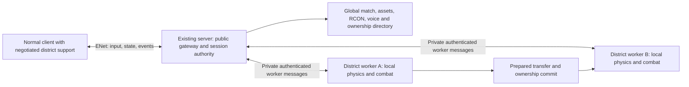

# District simulation: server and client integration assessment

**Feasible as an optional backend in the existing server, with district support in the existing client. It is not a working production option today.** A separate executable is unnecessary. An experimental launch profile would be useful during development, but a launch flag cannot replace the missing networking, handoff and gameplay integration.

The recommended first implementation is opt-in, fixed real-time Quake DM on a server-owned district manifest. Keep the existing monolithic backend as the default. Do not initially enable TF, TB, AS, global KOTH, lobby rotation or arbitrary imported BSPs. This assessment does not add a production setting or claim a playable multiplayer district client.

## What the code and probes establish

The current experiment is a local broker plus sixteen separate Godot processes. Each worker runs production movement/combat/AI over the static map, owns its local actors, and supplies full local snapshots over bounded, loopback TCP. The observer uses production avatar/projectile visuals and the clipped district scene. It has no human input path, first-person prediction or public multiplayer admission.

The production server/client instead use ENet, an explicit protocol handshake, map/model admission, bounded input packets, independently replicated state records, reliable event RPCs and player prediction. The differences are substantive:

| Area | Existing implementation | Integration work |
| --- | --- | --- |
| Startup/config | `arena.gd` starts one authority; `server/config.gd` rejects unknown settings | Select an optional backend before starting authority; supervise workers and drain them on shutdown/rotation |
| Admission | `_hello`, `_map_ready`, `_finish_join` bind identity and assets to an ENet peer | Keep one public gateway and one stable peer identity while district ownership changes |
| Input | `_input_packet` validates size, sender, map epoch and rate; `_accept_input` validates command/state | Gateway validates and routes to the owning worker; retain validation in the worker and add a district generation |
| Replication | One `replication.gd` state/cache/sequence and global broadcasts | Per-interest-group/per-client baselines, membership and sequences; adapt worker state to production record types |
| Prediction | Saved input acknowledgements, jump/fire delivery, interpolation and local movement | Atomic baseline switch, clock mapping and invalidation of old-district prediction/events |
| Match state | One round clock, scores, votes, teams and mode controller | Gateway-owned global match state and deduplicated worker gameplay events |
| Assets | BSP download plus trusted client code; prepared district files currently live under excluded `tools/` and `maps/` paths | Package district runtime, shaders and validated data manifest; prepare/cache geometry by BSP hash |
| Operator controls | One bot population, RCON, log/rotation/voice service | Aggregate ownership/population and route controls without accidentally simulating actors twice |

A reproducible [integration probe](../tools/district_sim/integration_probe.gd) performs trusted local API/codec tests. [Raw results](validation/district-integration.json):

- A positive human actor ID accepts a routed normal movement command through production `_accept_input`; sequence 17 is acknowledged.
- The production replication codec round-trips health 73 and input acknowledgement 17 when supplied a production-shaped snapshot and actual mode state.
- A raw district snapshot is rejected by the production receiver. The prototype uses a different transport and message schema.
- Export/restore retains human identity, health, armour and the tested relative invulnerability/respawn deadlines.
- **Two clock gaps are reproduced.** Moving from clock 100 to 800 leaves a buffered firing deadline at 100.25 (remaining time −699.75 seconds), and leaves the source view timestamp 700.08 seconds old. `state.gd` rebases its listed top-level deadlines, but does not cover `fire_pending[2]` or `view_time`. Pending actions, nested combat state and lag-compensation time must be audited, not assumed safe from bot-only transfer tests.
- `set sv_simulation districts` is currently rejected. This is a proposed setting name, not an available command.

These probes are not an ENet human-client test and do not establish prediction, lag compensation, audio, VR or crash-recovery correctness. Production input still needs the gateway's sender/epoch/rate checks; the probe's direct private API call is not a public admission design.

## Recommended architecture

Keep the public ENet connection stable. Clients should not reconnect to a different district port. The gateway retains admission, identity, assets, policy, global match state and an actor-to-worker directory. A worker is the sole physics/combat owner of an actor. The gateway must not also run the ordinary `_server_tick` for those actors.

Use process isolation first. It already works with the active scene tree, physics and navigation. Replacing it with shared-scene threads would require a much larger data/physics ownership refactor. The packaged console runtime already has networking, physics and navigation modules, but the district worker needs an explicit startup branch and inclusion in its resource dependency graph. Current workers instantiate the arena as a practice game and manually tick it; an exported dedicated build unconditionally enters `_start_dedicated`, so simply invoking that worker script in the server package is insufficient.

Proposed settings such as `sv_simulation = monolithic|districts` and a validated district-manifest path should fail clearly on unsupported modes/assets. Worker count should follow the manifest, not assume every map is the kilometre map. `State.district`, actor placement, pickup selection and the present renderer hard-code a 4×4 grid; those must become manifest-driven first. New code/assets belong under a packaged runtime directory, not `tools/`.

For multiplayer, target real time in every worker. The 4× setting is a stress-test facility. Independently drifting accelerated clocks should not be presented as one coherent human match. A crowded district still bottlenecks one worker; admission limits and overload reporting are required before claiming higher player capacity. Keep the current public player limit until real clients are measured.

## Client choices

| Choice | Assessment |
| --- | --- |
| Unchanged current client connecting directly to the prototype | **No.** ENet admission/state/input and the local TCP observer protocol are incompatible. The observer is not a playable client. |
| Existing client with a negotiated district capability | **Recommended.** Reuse desktop/VR input, movement prediction, avatars, weapons, menus and audio; add district assets, generations, interest management and atomic handoff handling. No separate binary is inherently required. |
| Same client/server binaries with an experimental launch profile | Useful for a first playable test deployment. It isolates unfinished behavior and can require an explicit matching protocol version. It still needs all gameplay/network changes above. Proposed flags are not implemented by this assessment. |
| Server adapter that hides districts from unchanged clients | A limited full-map-rendering experiment is possible using production-shaped packets. It would not provide district-only rendering or a safe acknowledged handoff. Roster/scoreboard semantics, clocks and global events make full compatibility substantially harder than a codec adapter. |

Eventually the server handshake can advertise district capability plus the map/manifest hash; an updated ordinary client can choose the path automatically. Older clients should receive a clear unsupported-server response rather than silently using wrong prediction or assets. During development, require explicit opt-in on both ends.

The current ordinary clients already have the useful input and rendering components. The observer's `view.gd` disables arena physics, hides UI/viewmodels and follows bot −1 with a separate camera. Turning that observer into a player by merely exposing mouse input would bypass the existing prediction, life/epoch guards and VR rig. Reuse those production paths instead.

## Handoff and gameplay requirements

A server-owned approach volume should prepare the next district before the actor reaches the gate. The destination geometry/collision and baseline must be ready on the client before visibility changes. Use an acknowledged transition generation, a final source input acknowledgement, destination readiness, a single ownership commit and a fresh destination baseline. Bound the input queue while ownership is in escrow; define whether buffered actions are replayed once or require a fresh edge. Old source packets must never move the actor after commit.

Separate the map epoch, district generation, actor life serial and snapshot sequence. Use globally unambiguous projectile/event IDs. Rebase or explicitly reset nested combat deadlines and lag-compensation state; do not blindly copy source history. Reset prediction/interpolation and jump/fire retransmission state against the new acknowledged baseline. A worker's rollback must not race a destination that already committed.

The opaque gates now conceal adjacent districts in ordinary views, but are thin visual planes. Their presence alone does not prove a seamless handoff for VR head lean, spectator cameras, packet delay or dropped readiness acknowledgements. Test those cases; a short opaque transition volume/vestibule may be needed. Gate geometry remains walk-through and should not acquire collision merely to mask a networking stall.

Keep the initial gameplay boundary explicit: the prototype terminates outgoing projectiles and has no targets across districts. It also leaves source-owned effects/projectiles behind when an actor transfers. Define delayed damage/kill credit, death during transfer, respawn district, sound scope and projectile ownership before enabling public play. Global scoring/round end and bot population need one authority. Team modes and moving objectives need additional coordination, not just a larger worker count.

The current broker subscribes only one observer and the worker stores a boolean subscription. Multiple clients need subscription reference counts and recipient routing. Worker identity and messages must be validated at the private boundary; the trusted test wire should not become a public service. The current experiment stops on worker failure or ambiguous commit timeout and has no journal/reconnect recovery. A production option needs a durable or otherwise recoverable commit decision, idempotent retries and a defined failure policy.

## Suggested implementation order and acceptance

1. Extract manifest-based ownership, worker startup and transport into an opt-in server backend. Keep monolithic defaults and reject unsupported maps/modes. Package workers using the console dependency policy and exercise graceful shutdown.
2. Add one public ENet gateway and an updated desktop client. Start with two districts/two real clients. Route normal inputs and production-shaped records, including rosters, acknowledgements, pickup/projectile events and global scoreboard.
3. Implement prepared, acknowledged handoff and audit the entire transferable state. Test repeated bidirectional crossings while walking, jumping, firing, reloading, taking damage and dying. Verify no actor duplication, input replay or camera rubberbanding.
4. Add loss/reordering/latency, rejected prepare, worker crash before/after commit, reconnect and map rotation tests. Two clients in different districts must receive independent streams; an unsubscribed district must continue its authority simulation without continuous client scene traffic.
5. Validate VR head/hand motion, room-scale movement, audio and weapon presentation. Then profile 16 districts under uneven populations and real clients before increasing public capacity or supporting global team objectives.

Relevant implementation entry points: [startup/admission/input/snapshots](../deathmatch/arena.gd), [server configuration](../deathmatch/server/config.gd), [replication](../deathmatch/network/replication.gd), [prediction](../deathmatch/movement/prediction.gd), [fire delivery](../deathmatch/network/fire_delivery.gd), [lag compensation](../deathmatch/lag_compensation.gd), [server pack builder](../tools/build_console_server.py), [export exclusions](../export_presets.cfg), and [district prototype](../tools/district_sim/README.md).

## Subsequent CQ rules implementation

The [CQ experimental base](CONQUEST.md) now adds an isolated launcher/protocol, an independent 64-seat configuration, territory objectives and district-aware spawning/radio to the ordinary server authority. It does **not** integrate the independent workers assessed above. The transfer/prediction, interest management, clock and recovery requirements in this assessment still apply to that later backend work.
