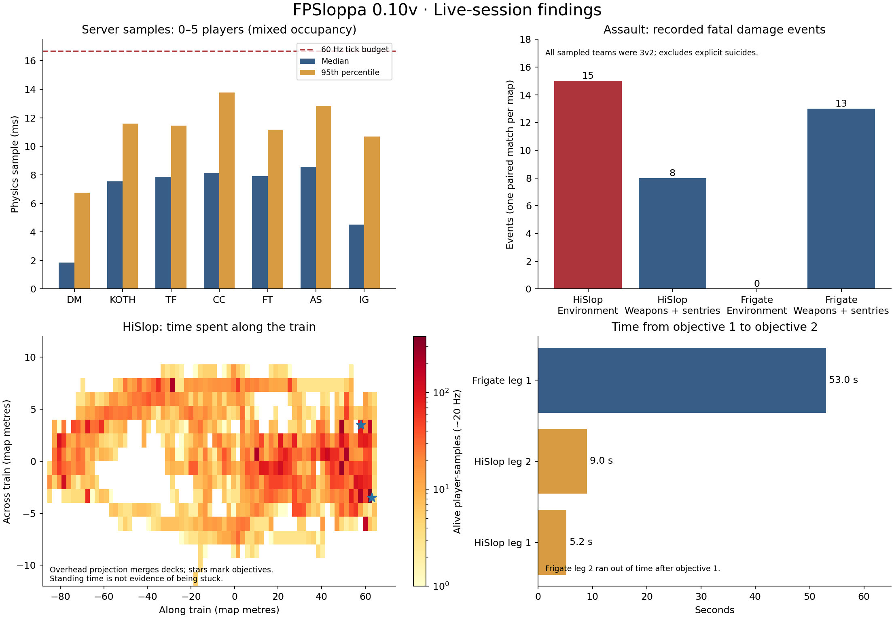

# 0.10v live-session analysis and recommended changes

The first priorities are **HiSlop's hazardous traversal and compressed final stage**, **map-transition stalls and transport diagnostics**, and **a controlled latency test of firing/prediction**. The evidence does not justify a general damage buff, larger hitboxes, or tying movement to display FPS.

This review uses the supplied `serverup.log` (two appended server sessions, 1,110 health samples, peak five players), four demos containing about 24 minutes of usable snapshots, source inspection, a live 16-spectator connection test and read-only SSH inspection. The server remained on 0.10v; its process and configuration were not changed. No SSH credentials are stored in these artifacts.

## Performance and connection reliability

| Evidence | Interpretation and proposed action |
|---|---|
| Config and startup both report 16 slots. Sixteen independent clients joined simultaneously and held for 20 seconds. All four server health records show 16 players and zero pending joins. | Capacity works. All test clients disconnected; server connect/disconnect counts balance. This tests admission and replication with spectators, **not 16-player combat or VR rendering**. |
| Full-capacity spectator samples: physics 2.0–5.4 ms, process 1.1–4.2 ms. Server: two vCPUs, about 146 MiB RSS, eight threads. | No evidence here of sustained CPU or memory exhaustion. A short observation cannot establish absence of memory leaks. Run a 16-player combat soak with simultaneous rockets/plasma, voice and model transfers before advertising its performance. |
| Supplied session: physics median 6.0 ms, p95 11.2 ms, p99 16.0 ms; maximum 326.5 ms. The largest two spikes (326.5/132.2 ms) coincide with map changes and admission. | Prioritize loading: prepare collision/navigation resources before committing the map, spread main-thread scene activation across frames, and keep the join barrier closed until ready. Disk work is already threaded; scene/physics activation still needs measurement. Five-second health records are samples, not a complete frame-time histogram. Add per-phase timings and per-second tick maximum/p95. |
| Game UDP socket: 212,992-byte receive buffer and 351 cumulative drops. Host-wide receive-buffer errors: 1,343. The game counter did not increase during SSH inspection. | There is evidence of past receive loss, but no timestamp links it to reported failed joins or this test. Sample socket-drop deltas during map loading and downloads. Then trial a bounded buffer increase and transfer pacing on a test instance. An OS limit change alone does not prove the application socket changed; verify its actual buffer afterward. |
| Ping median 29 ms, p95 245 ms; 685 of 3,678 player samples exceeded 100 ms. Normal input age p95 33 ms, but rare stale-input samples reached 15.5 s. | Split results by player latency and connection state. The tail is materially different from the typical connection. Add timeout-stage, packet-loss, sequence-gap and reconnect telemetry before attributing failures to hit detection. |
| No game-level join rejection/timeout appears in the supplied log. The accessible current console/engine logs contained no startup error. | The affected users' original failure remains unproven. Collect their client engine/network logs with UTC timestamps; correlate them with transport admission. Do not infer success for all users from this machine's successful test. |

For the socket experiment, keep queueing bounded: larger buffers can also conceal a slow consumer. The relevant settings are documented in the [Linux kernel network sysctl reference](https://docs.kernel.org/admin-guide/sysctl/net.html). Godot exposes per-host traffic statistics through [ENetConnection](https://docs.godotengine.org/en/4.7/classes/class_enetconnection.html); add byte/packet deltas alongside the current input counters.

## Weapon handling and hit detection

**Keep the current damage values until a controlled test separates aiming, latency and availability.** In the KOTH demo, pistols fired 570 times, including 276 offhand shots: both hands are demonstrably used. Pistol/chaingun first shots are already accurate after release; held fire adds spread. Make this behavior discoverable with a small accurate-shot/blocked-muzzle cue and consistent grip-relative aim-guide placement. A per-weapon grip-offset calibration is preferable to silently steering the gun toward targets.

Add an optional bounded shot trace: shot ID, weapon/hand, input sequence, server receipt time, pose age, accepted/rejected reason, clearance adjustment, origin/direction, rewind age, world obstruction, target/life and applied health/armor damage. Return authoritative hit feedback keyed to that shot. Currently the logs record damage, while demos record fired effects; neither provides a reliable denominator for misses, rejected trigger attempts or per-pellet accuracy. Shot counts and kill counts are **not accuracy percentages**.

The code already sweeps projectiles against moving targets, uses a 0.40 m damage-capsule radius, rewinds hitscan targets by a bounded history and checks world obstruction. Avoid another global radius increase: it risks corner hits. Test stationary and crossing targets at 30/100/250 ms RTT, with jitter/loss, crouches, stairs and close-ground rocket shots. Log the capsule/obstruction decision for failed cases. Review the current 300 ms rewind ceiling and 120 ms allowance against those measurements; do not simply lengthen them for the high-ping participant.

A visible explanation is also needed for map sentries: current kill messages show the victim's name on both sides when the attacker is world-owned. The damage log correctly records owner 0, and the frag code does not penalize that absent owner. Label these deaths `SENTRY → player` or environmental damage so they do not look like suicides.

## Movement, avatar stability and demo integrity

Movement already uses physics delta; rendering is interpolated separately. Preserve that design. Driving authoritative collision from each client's render FPS would make results hardware-dependent. Godot recommends a consistent simulation tick with suitable rendering interpolation, with custom interpolation often appropriate for multiplayer. See [Godot's physics interpolation explanation](https://docs.godotengine.org/en/4.7/tutorials/physics/interpolation/physics_interpolation_introduction.html).

The recordings have a typical 50 ms snapshot interval, with 66.7 ms p95 intervals and occasional gaps up to 2.65 s. These are recording/received-state timings, **not measured headset frame times**. Typical horizontal speeds are 7.6–9.2 m/s; p95 reaches 12.4–14.1 m/s and maxima reach 20.7–29.4 m/s. Faster-than-run movement can be legitimate bunny hopping, swimming, pads or blast momentum; it is not evidence of cheating or a delta-time bug.

HiSlop's usable demo has a larger position-versus-velocity residual (p95 0.47 m versus roughly 0.23–0.30 m in the other recordings). This is a lead for instrumentation, not a measurement of local prediction correction: stairs, room-scale displacement and collisions also contribute. Record acknowledged-state error, actual correction, input delta, support/step result, contact normal and local body/root transforms. Compare collision position, smoothed view position and avatar root in the same capture. Trial replay of unacknowledged commands after correction only if those traces show the current additive correction causes repeated divergence.

Two demos validate completely. The other two contain valid prefixes followed by a **partial final payload**:

| Recording | Valid frames | Final payload: expected / present |
|---|---:|---:|
| 20:47:38 | 4,340 | 8,700 / 6,528 bytes |
| 20:53:17 | 11,102 | 8,628 / 6,012 bytes |

An interrupted recording or incomplete file copy is consistent with these endings; the data does not identify which occurred. A useful improvement is explicit “recover complete frames” playback for a truncated final record, with a warning, while continuing to reject malformed interior records. Periodic flushes, finalized-recording markers and copying only closed demos would improve diagnostics. Originals were left untouched; this review used only validated prefixes.

The spring test also exposed a concrete compatibility problem: on the current Godot version the obsolete no-override cache returned identity while the live bone pose was nonzero. The working changes use the live pose with SkeletonModifier3D, correct the chain-versus-skeleton index, and guard missing/root parents. A subsequent graphical replay exposed an additional optional Chest rest-pose lookup at index -1 on a 57-bone custom avatar. That lookup is now guarded in source and covered by a regression; this last guard was added after the APK build described below. This warrants another hardware movement capture; the headless regression does not certify visual IK quality.

## ASSAULT map gameplay

Both recorded paired Assault matches used **3 red versus 2 blue players throughout sampled play**. Red won Frigate; blue won HiSlop. Two matches cannot establish faction balance. For validation, use equal teams, swap the same players, distinguish first-time route learning from experienced play, and log each leg's ready/start time, objective damage, stage progress, checkpoint, spawn and finish reason.

**HiSlop should be revised first.** Its paired match produced 15 fatal `environment` events versus eight weapon/sentry deaths; Frigate produced zero environmental deaths and 13 weapon/sentry deaths, excluding explicit suicides. Verify the exact hazard/contact before moving geometry. Widen the most-used exposed transitions, add visible edge cues and limited catch/recovery routes, and check sludge exits and inter-car transitions at high speed. Preserve deliberate risky shortcuts while making the main route reliable. The occupancy plot shows route use across the train, but merges decks and cannot distinguish deliberate standing from being stuck.

The final stage was completed just **5.22 s** and **8.97 s** after the first objective. The first checkpoint progression and long approach carry most of the match. Give defenders a meaningful final regroup opportunity: test an offset approach or additional room between the terminals, keep a clearly guarded final entrance, and make the first door's state obvious. Check that roof/catwalk routes cannot bypass the intended gate. The short times alone do not prove a bypass. Use a short activation hold only if route changes still leave no contest; avoid adding a long compulsory wait to compensate for layout.

**Frigate's final stage already provides a longer contest.** Red completed the first leg in 72.62 s; objective 1 to 2 took about 53.0 s. Blue destroyed the compressor near the deadline and did not complete the second objective in time. Keep the 240 HP compressor baseline for now. Measure damage contributed and travel time through gangway versus underwater intake before changing objective health. Strengthen alternate-route signage and check that the defender spawn/sentry cannot cover both exits from one safe position. Scale checkpoint and pickup placement through testing at 2v2, 4v4 and 8v8, rather than applying one timer multiplier.

Use consistent objective activation rules across desktop and VR: currently desktop proximity can activate a touch objective, whereas VR needs a physical press or Use. Keep the physical interaction, but trial the same brief Use/press requirement for both, with an accessible fallback and clear completion feedback.

## TF map and class balance

Only **2fort5 completed a full TF round**: 1–0 after about ten minutes. Its one recorded flag pickup preceded capture by 79.7 s. Well6 was rotated away from without a logged round end. No supplied demo contains TF, so there is no TF route heatmap or class-use distribution. The TF health sample was mostly 3v2 (109 samples), with 54 at 2v2. These results do not support a confident class nerf/buff.

For 2fort5, test shorter recovery routes from water, clearer flag/return-route signs, and an attack route that breaks long sniper sightlines without eliminating their role. Preserve at least two independently contestable base approaches. Check converted resupply, doors and capture triggers individually: the loader adapts specific native entities, not arbitrary original QuakeC behavior. Measure spawn-to-midfield and flag-to-capture times for both teams before moving spawns or pickups. On Well6, prioritize a completed equal-team round and water-exit audit before redesigning it.

TF recorded 14 rocket, seven rail, three shotgun and two weapon-whip fatal events. This is not class-normalized damage: class selection, player-minutes, healing, construction, repairs, ammo supplied and building damage are absent from the log. Sentries registered only seven player-damage events and no kills; buffing them from that alone would be premature. Add class and ability telemetry, then compare objective contribution and survival per minute. Review engineer placement/repair discoverability, dispenser ammo feedback, medic targeting feedback and spy reveal/backstab feedback before changing their strength.

For larger games, test spawn protection and resupply placement against exit camping, sentry placement against flag/spawn coverage, and whether ammo routes force attackers through a single choke. Apply any map changes to the locally hosted conversions while respecting their existing distribution notices; they are not additions to the unified base APK.

## Other balance signals and next test order

Chainsaw Circus produced 32 hunger deaths versus 31 chainsaw deaths. Trial slightly more grace after spawning or a gentler hunger ramp on larger maps, measuring time to first enemy contact and health earned in combat. Freezetag damage logging currently returns before recording a lethal freeze, so its apparent zero weapon deaths cannot be compared with other modes. Record a distinct freeze/thaw outcome. KOTH's moving hill implementation should be tested for route fairness, vertical separation and spawn advantage; changing sites alone does not establish balance.

Recommended order: (1) instrument transitions/socket drops and shot outcomes; (2) test HiSlop hazards/final-stage routes; (3) equal-team AS/TF sessions with the same roster on both sides; (4) controlled latency/prediction tests; (5) 16-player combat/voice/download soak; (6) tune weapon/class values using per-minute and per-opportunity data.

## Changes packaged during this work

The unified Quest/Pico APKs include 70 verified base files (about 198 MB each). They also include TF ability cooldown, actual team colour and persistent flag-carrier HUD cues, final-ten-second clock ticks, the physical-jump dip fix, local pickup audio and a 1.05 m pickup radius, moving KOTH hills, root/missing-bone guards, engine/join diagnostics, authenticated RCON, independent menu/scoreboard behavior, a saved lobby scoreboard and trigger-drag mute/model lists. Existing desktop/server published artifacts and the live server remain 0.10v. These APKs are locally built, not published as a new GitHub release; native headset installation still needs verification.

Regression results: offline archive installation/repair/path validation; physical jump and crouch traces at 60/72/90/120/144 Hz; 57-bone/root and live-pose checks; KOTH threshold/contested behavior; saved results across lobby transition; drag-selection preservation; existing scoreboard and simulated VR-pointer tests. RCON rejects wrong passwords, stale nonces, forbidden modes/maps and command chaining. Both APKs passed current-script, embedded-file hash, vendor permission, signature and alignment verification.

Evidence: [session aggregates](validation/live-0.10v/session.json), [demo audit](validation/live-0.10v/demos.json), [live capacity](validation/live-0.10v/capacity.json), [SSH inspection](validation/live-0.10v/remote-inspection.json), [regressions](validation/live-0.10v/regressions.json), [RCON](validation/live-0.10v/rcon.json), [APK verification](validation/live-0.10v/android.json).

## Regional reachability and controlled latency

Globalping probes in Germany, the United States, the United Kingdom, Brazil and Japan all reached the host: three ICMP replies per region with no loss. Mean ping was 5.7, 154.0, 19.4, 203.9 and 221.8 ms respectively. Separate UDP traceroutes addressed to port 7777 reached the target from all five regions. These are real geographically distributed route probes, not spoofed source addresses or full game handshakes. They provide no evidence of a blanket block for those tested routes; they do not exclude filtering of other source networks or intermittent provider mitigation.

The unmodified published 0.10v client also completed four sequential real ENet joins through a local bidirectional UDP impairment proxy. Each stayed connected for at least eight seconds after admission, then disconnected cleanly. Assets were already local, so this does not test large downloads over a degraded link. No simulated queue overflow or socket errors occurred.

| Added network conditions | Join time | Highest sampled client ENet RTT | Result |
|---|---:|---:|---|
| baseline | 0.257 s | 30 ms | Joined; no transport disconnect |
| 100ms-added-RTT | 0.677 s | 130 ms | Joined; no transport disconnect |
| 300ms-jitter-1pct-loss | 1.521 s | 333 ms | Joined; no transport disconnect |
| 600ms-jitter-3pct-loss | 3.591 s | 640 ms | Joined; no transport disconnect |

Jitter is uniform ±30 ms per direction in the 300 ms profile and ±50 ms in the 600 ms profile, with independent 1% and 3% packet-loss probabilities respectively. All profiles use the same local public egress and are not geographic VPN tests. The initial harness incorrectly treated losing the spectator flag during a lobby transition as disconnection; the reported rerun checks ENet transport state instead. Server-distributed player ping is capped at 400 ms in 0.10v, so the uncapped client ENet statistic was collected separately.

ProtonVPN is available to the user, but no VPN client or signed-in session was found locally. No VPN route was changed; region-specific authenticated game joins remain pending usable profiles/sign-in. A normal HTTP CDN cannot relay this ENet UDP traffic. Cloudflare Spectrum supports generic UDP on Enterprise with a paid add-on, which would require a separate service decision; no service was purchased or configured. See [Spectrum protocol availability](https://developers.cloudflare.com/spectrum/protocols-per-plan/).

Evidence: [regional ping](validation/live-0.10v/global-ping.json), [UDP routes](validation/live-0.10v/global-udp.json), [controlled ENet tests](validation/live-0.10v/latency.json). To resolve an actual rejected connection, correlate a failing client's UTC attempt time, source network and client stage log with a short server packet capture and provider mitigation logs. A successful test from another network cannot by itself attribute that failure.
