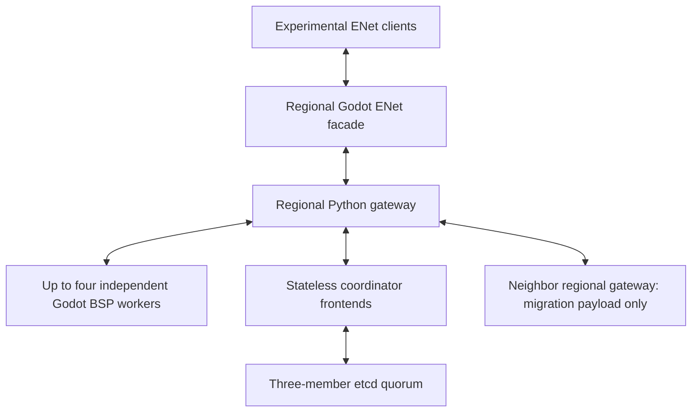

# Persistent district cluster prototype

Implemented on `experimental/cq-districts`, independently of the shipping CQ server path. This is a working server foundation with **4–81 configured districts, up to four districts per regional gateway, and sixteen reserved player slots per district**. The separate protocol is `fpsloppa-persistent-cluster-1`. The optional [81-district campaign](CAMPAIGN-81.md) adds its own authored atlas, rules and prototype desktop client; the generic profile remains independent of those rules.

District identities, map templates and gateway assignments are separate. The topology is a connected graph with up to four explicitly positioned portals per district; it no longer derives world membership from CQ's 4×4 coordinates. In the generic profile, the coordinator has no teams, capture prerequisites, homebases, victory condition or round timer. The Godot adapter retains the existing UT99 combat, movement, jetpack and BSP collision code without advancing CQ capture rules.

## Implemented architecture



A local SQLite backend is also available for development. It uses WAL transactions with synchronous FULL; it is not a replicated coordinator. With etcd, multiple coordinator frontends share durable metadata through linearizable reads and revision compare-and-swap transactions. Killing one frontend does not lose ownership. Gateways can try another configured frontend. Consensus and durable storage come from etcd, not a newly invented replication algorithm. The [etcd gateway API](https://etcd.io/docs/v3.6/dev-guide/api_grpc_gateway/) and [transaction API](https://etcd.io/docs/v3.6/learning/api/) define the wire operations used here.

The coordinator stores topology, gateway/worker incarnations and leases, actor identities, generations, reservations, waiting state and transfer decisions. It does **not** receive movement inputs, world snapshots, projectile streams or migration payloads. Regional gateways route those directly, caching one encoded snapshot response per district and sharing its bytes between recipients. Actor rosters are local to a region and its pending transfers; district metadata subscriptions cover the region and adjacent districts.

The initial data transport uses bounded TCP/JSON on private loopback endpoints. The separate Godot facade exposes ENet, with reliable control and a separate reliable snapshot channel. It forwards cached complete baselines; production unreliable delta streaming and integrated desktop/VR prediction remain future work. It is not the shipping arena RPC protocol. A headless ENet client fixture exercises join, input, snapshot and logout; the normal game menu cannot yet join this cluster.

## Capacity and ownership

Maximum active capacity is 16D, reaching 1,296 slots at eighty-one districts. Source rollback reservations and destination preparations both consume slots. New waiting joins consume a separate configurable allowance (default 128), not worker capacity. Already admitted campaign players can always enter reinforcement waiting after death. Full or draining destinations reject incoming transfer reservations. Fully occupied worlds therefore have no open destination gates.

A transfer reserves the destination, freezes the source into escrow, prepares the destination with a SHA-256-identified state payload, records a durable commit decision, explicitly retires the source, and finally activates the destination generation. The source reservation is released only after retirement acknowledgment. Worker source escrow and destination preparations are journaled locally. A lost preparation acknowledgment leaves both reservations held; retrying the same pending handoff finishes it. Committed transfers cannot be rolled back. Clients should generate and retain `identity` and `resume` secrets before their first join, making a retried admission idempotent. Clients reconnect to the destination gateway with their actor identity and resume secret; resume can locate the new gateway if the final redirect response was lost.

Portal coordinates are map-local. Handoff transforms position offsets, view yaw, velocity, jetpack heading and blast velocity into the destination frame. Health, ammunition and existing actor/jetpack state use the current `State.actor` serialization. The worker validates portal proximity before escrowing an actor. Arbitrary public teleport requests and obsolete generations are rejected.

Death remains resident until an explicit worker-validated respawn; same-district respawn reuses its reserved slot. Generic waiting deployment selects the nearest available district by graph distance, with no CQ team restrictions. A small global free-slot summary wakes gateways to retry connected waiting actors when deployment capacity changes, and clients may explicitly request deployment. A waiting actor that reconnects after gateway loss can resume and request deployment. This prototype exposes waiting status through the protocol; it does not add a new rendered waiting-room UI.

Worker authority lasts at most two seconds after a successful coordinator exchange. Gateway/worker reassignment waits for a six-second lease, leaving a fencing margin. Authority packets carry an absolute expiry as well as a duration, so a delayed buffered packet cannot renew an old worker lease. Requests fail closed when authority expires. An offline worker does not stop unrelated regions. Reclaiming a changed worker incarnation can temporarily pause its region while the previous lease expires. Deploy the prototype with synchronized clocks and low-latency links: the lease margin assumes bounded clock skew and message delay and has only been tested on one host.

Bounds include 1 MiB transport messages, a 512,000-character opaque payload limit, sixteen worker residents, four regional workers, bounded ENet inflight requests, input/snapshot rate limits and timed slow-peer writes. Metadata and migration state stay separate. A coordinator fault does not authorize cached ownership indefinitely.

## Dynamic membership

`init` provisions credentials for eighty-one stable district identities and twenty-one gateways, while initially configuring only the requested 4–81 districts. This permits later activation without changing service credentials. Generic districts reuse the sixteen map templates. `init --campaign` selects the complete, fixed 81-map campaign atlas; campaign membership cannot be edited into an incomplete layout, but its workers can be stopped or drained independently.

To expand, submit a complete new topology through the administrative endpoint, retaining existing identities and adding reciprocal portal links. Start the newly assigned gateway if necessary, then its worker. The new district becomes eligible for admission after worker authentication and a coordinator heartbeat. Existing clients do not need a global match restart.

To remove a district:

1. Set `draining=true` through the `drain` operation. Incoming gates close; resident actors may leave or log out.
2. Wait until its reservation count is zero, including transfers. Busy districts cannot be removed or assigned a different map/region.
3. Stop its worker and allow the old authority lease to expire.
4. Submit the reduced topology with reciprocal links updated. At least four configured districts and a connected graph must remain.

This is graceful drain, not forced player deletion. An unavailable worker with unresolved actors is deliberately retained for recovery. Portal rewiring that touches pending handoffs is rejected. Adding/removing links beside ordinary resident actors is allowed. A process failure can temporarily leave fewer than four reachable districts; the four-district minimum applies to configured topology, not a requirement to shut the remaining regions down.

The generated graph is a provisioning example. Map authors must place portals to match actual accessible entrances and choose appropriate map templates. The runtime does not cut new openings through BSP walls or assume all repeated district art already matches every possible graph.

## Running the prototype

Run from the experimental worktree. Python uses only the standard library. Godot 4.7.2 and the existing prepared CQ district assets are needed for game workers. All supplied endpoints bind to loopback; use private tunnels between hosts. Provisioning files contain credentials and are created with mode 0600. Do not check them into Git.

```sh
python3 -m tools.district_cluster init \
  --config test-results/cluster/private.json --districts 4

# Single durable development coordinator:
python3 -m tools.district_cluster coordinator \
  --config test-results/cluster/private.json \
  --database test-results/cluster/control.sqlite

# One region (start more named gateways as the topology grows):
python3 -m tools.district_cluster gateway \
  --config test-results/cluster/private.json --name g00

python3 -m tools.district_cluster admin \
  --config test-results/cluster/private.json
```

For replicated coordination, provision a three-member etcd cluster, list multiple coordinator frontend addresses in `coordinators`, and start each frontend with its own `--index`, the same namespace `--key`, and the same etcd endpoints:

```sh
python3 -m tools.district_cluster coordinator \
  --config test-results/cluster/private.json --index 0 \
  --etcd http://127.0.0.1:2379 http://127.0.0.1:2381 http://127.0.0.1:2383 \
  --key /fpsloppa/persistent/control
```

The etcd addresses above are examples of already-provisioned client endpoints. Do not start independent SQLite coordinators and call them replicas: they would represent different worlds. etcd mode does not use `--database`.

Build the worker package using the existing console-only template:

```sh
python3 tools/build_console_server.py \
  --template Builds/CQVulkanPolicy/FPSloppaServer.x86_64 \
  --output Builds/ClusterPrototype --cq-district-maps

python3 -m tools.district_cluster worker-config \
  --config test-results/cluster/private.json --district d00 \
  --output test-results/cluster/d00.json --state-dir test-results/cluster/workers

Builds/ClusterPrototype/FPSloppaServer.x86_64 -- \
  --asset-root "$PWD/Builds/ClusterPrototype" \
  --experimental-cq --cq-district-maps --cq-worker 0 \
  --cluster-worker "$PWD/test-results/cluster/d00.json"
```

`--cq-worker` selects the local map template 0–15; the private worker file identifies the independent cluster district. They must agree on `map_slot`. Start one process per active district. `worker-config` reads the supplied provisioning file, so keep that file's topology synchronized with administrative changes before generating newly attached worker files. Each district gets its own journal directory.

To expose the regional ENet development entry point:

```sh
python3 -m tools.district_cluster edge-config \
  --config test-results/cluster/private.json --name g00 \
  --output test-results/cluster/edge-g00.json

godot --headless --xr-mode off --path . \
  --script tools/district_cluster/edge_main.gd -- test-results/cluster/edge-g00.json
```

The generated ENet listener uses the region's private backend port plus 100. `edge.gd` is the reusable client/server RPC adapter. An ENet probe configuration contains `address`, `token` (the cluster client credential) and `district`; invoke `tools/district_cluster/edge_client.gd` with that private file. The facade translates cross-region redirects to the corresponding ENet addresses.

Administrative requests are JSON files passed with `admin --request <path>`. For example, `{"op":"drain","district":"d07"}` begins draining; `{"op":"topology","districts":{...}}` replaces the graph transactionally. Status includes counts and availability but never returns credentials. Normal clients cannot submit administrative, worker or mesh commands through the ENet facade.

## Validation and current limits

Recorded results are in [the validation receipt](validation/persistent-district-cluster.json). Tests cover:

- Sixty-four synthetic worker connections, sixteen gateways and 1,024 simultaneous actor reservations; full-world gate closure, scoped shared snapshots and waiting deployment.
- Cross-region state handoff, generation/sequence rejection and recovery after losing the destination's preparation acknowledgment.
- Live 4 → 8 → 64 expansion and drained 64 → 4 contraction while retaining a resident actor; online removal and a three-district topology are rejected.
- Two actual Godot worker processes loading different split BSP collision maps, input, hover activation, bidirectional handoff, preserved health/jetpack activation/cooldown, and destination input.
- A real Godot ENet client joining the facade, sending input, receiving a district baseline and logging out.
- Three actual etcd processes and two coordinator frontends: concurrent capacity admission, leader/frontend loss, retained committed actors and rejection after quorum loss.

These are functional tests on loopback. The sixty-four-worker test uses protocol fixtures, not sixty-four fully occupied combat simulations or 1,024 rendered clients. The two-map game test has a small actor count. Existing Godot ObjectDB shutdown warnings remain distinct from script/test failures.

The coordinator currently serializes metadata writes through one etcd key, bounded to 700 KB before encoding. This is a correctness prototype for replicated coordination, not the high-throughput sharded control database from the long-term design. It still needs load measurements with real quorum storage, capacity deltas, batching and smaller per-region keys before a production capacity claim.

Persistent metadata survives coordinator restart. **Complete gameplay persistence is not implemented:** local transfer journals protect handoff preparation, but workers do not continuously checkpoint combat, pickups or AI. A worker process restart may lose or restore older simulation state. There is no production crash-recovery guarantee, account system, client prediction integration, automatic asset download, district radio integration or geographic failover certification. Journal writes are flushed and atomically renamed for process recovery; power-loss durability of those Godot journals is not certified.

The supplied services and tests are opt-in. Ordinary CQ and main-branch admission, maplists, rendering and release artifacts are unaffected.
