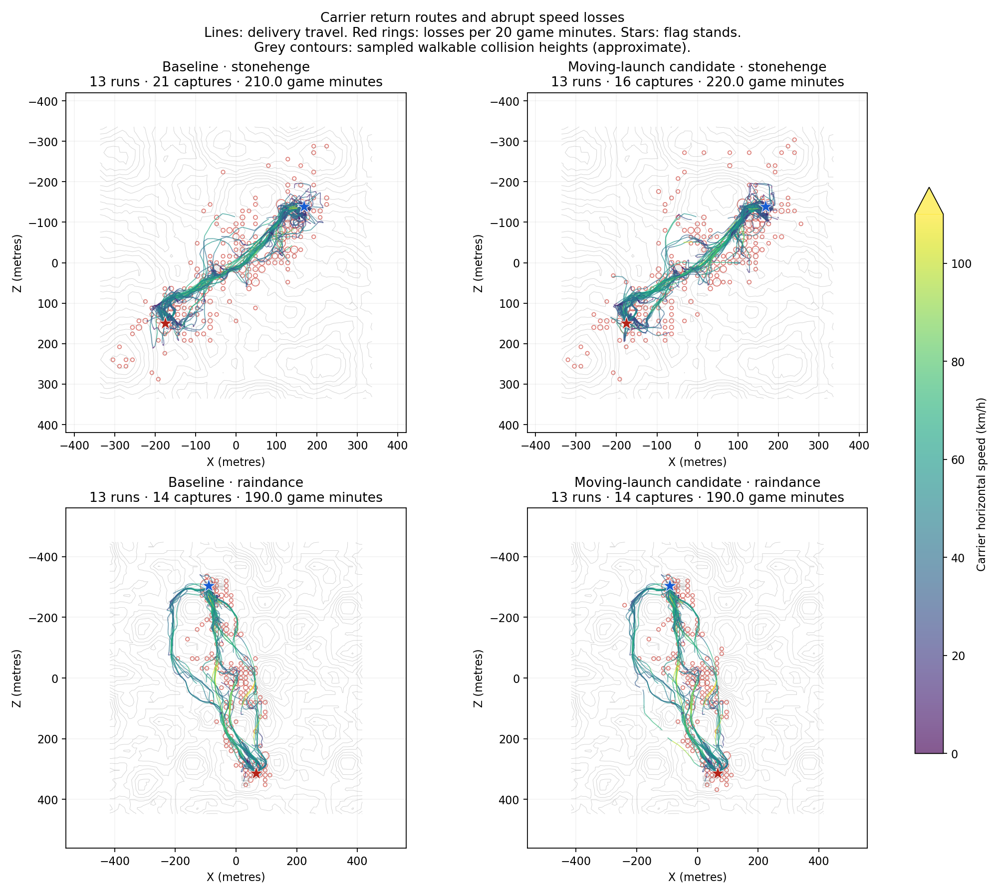

# ST routing and ski-to-jet study

This study is confined to `experimental/st-raindance`. ST remains excluded from
release. Combat, role assignments, item use, armour physics, energy capacities,
weapon damage and map geometry are held constant.

## Comparison protocol

The baseline is gameplay commit `d8b0de0` (checkout `27f346f`). The paired study
uses seeds 9400–9412 on both Stonehenge and Raindance: 26 baseline and 26 selected
8v8 authority simulations. Every run uses the actual server, all sixteen bots,
combat, respawns, equipment, structures, flag rules and collision. It is not a
movement-only simulation. A frozen script snapshot and map hashes accompany
each batch. An additional 26-run terrain/slope experiment (`refined`) is retained
as a rejected iteration. Eight further matches on fresh seeds 9413–9416 validate
the final lateral-correction safeguard, bringing the principal study to 86
full-authority runs. The 26-run `selected` cohort predates that final safeguard;
its paired comparison must not be labelled as 26 tests of the guarded code.
The server uses normal 60 Hz physics, time scale 1, and Godot's
`--fixed-fps 60` to remove wall-clock pacing. There is no spectator or rendering.

Normal limits are twenty game minutes or five captures. The existing first
capture and post-capture next-pickup deadlines remain 600 game seconds. Reports
retain cutoff failures and distinguish them from normal endings. Crashes,
wall-clock timeouts and deliberately interrupted explorations are not completed
validation runs. Identical seeds reduce variance, but asynchronous engine work
means these are not guaranteed to be bitwise deterministic replays.

Telemetry records route position, phase, energy, slope, velocity and goals every
second, plus per-frame contact departures and abrupt speed losses. A contact
departure need not be a sustained flight; analysis debounces events. An abrupt
loss can include terrain contact, braking or a combat impulse, so it is not
labelled as a proven wall collision. Speeds are horizontal. Reported run medians
avoid treating thousands of correlated movement samples as independent trials.
Slope summaries use the current velocity direction; they are not a strict
compliance test of the intended steering direction during turns or braking.
The attacking-speed and 35-second progress summaries reuse the recorded-match
analyser on one-second travel samples.

## Reference evidence

`docs/validation/st-routing-references-2026-09-28.json` pins the inspected video
sources and the previous FPSloppa recordings. Original Tribes footage provides
qualitative route and approach references, not calibrated positions or speed
measurements on the adapted BSP29 maps. The Raindance capper footage shows
successive gullies leading to the separate exposed flag shelf; the Stonehenge
sequence shows travel between the gully and raised deck. Neither justifies
stationary hovering beneath the destination lip.

The video-linked seed 9301 FPSloppa runs finished Stonehenge at 2–1 in twenty
minutes and Raindance at the ten-minute no-capture cutoff. Raindance had twelve
flag pickups and forty-one failed launches. Median attacking travel speeds were
35.69 km/h on Stonehenge and 39.60 km/h on Raindance. Those six-a-side recordings
are contextual evidence; they are not mixed into the paired eight-a-side sample.

## Retained changes and rejected experiments

The final implementation keeps the original terrain costs, attack-lane routing,
grounded lookahead and slope controller. It retains two bounded changes:

- Moving shelf launches predict the existing pulsed jet controller at 60 Hz,
  including remaining energy and recharge. This permits useful partial-fuel ski
  approaches that a continuous-full-burn requirement rejected. A lateral-correction
  budget retains the staged approach when turning would consume the predicted
  lift. In the expanded fixture, a 22 m/s, −12° entry otherwise needed 16.9 seconds
  versus baseline 14.8; the safeguard restores the baseline 14.8-second route.
  Six straight or milder cases complete in 2.1–2.6 seconds.
- Repeated edge-cost calculations are cached across alternative lanes with the
  same movement context. Failure penalties remain query-local. Equivalence
  checks compare paths against uncached queries across armour classes, energy
  reserves, directions, lanes and avoidance notes.

A controlled Raindance hill approach at 18 and 22 m/s, with 35 energy, captures
in 2.55 and 2.12 seconds using the moving launch. The baseline stops and takes
14.35 and 13.53 seconds. These are controlled inputs on the real map, not observed
match averages. The final selected-source repetition and all-spawn checks are
recorded separately from the earlier experimental source.

The broader `refined` experiment added downhill/steep-climb terrain costs,
weighted outbound routes, a grounded contour lookahead restriction, and ski
retention during powered upslope contact. It passed all 32 unopposed capture
cases, but completion alone hid a regression. The first four paired Stonehenge
spawn cases took 17–38 seconds longer than baseline. Ablations that restored
route costs and then lookahead showed mixed, spawn-dependent effects. Restoring
route costs averaged 156.5 seconds but worsened the slowest case to 247.2 seconds;
restoring lookahead as well averaged 158.2 seconds (maximum 230.3), close to the
baseline 158.8 seconds (maximum 232.3). These isolated checks do not establish
contested-match gains. All source snapshots and measurements are retained. The broad
experiment is rejected rather than presented as a successful speed improvement.

The completed thirteen-seed comparison confirms that decision:

| Map | Baseline captures | Terrain/slope experiment | Runs with a capture, baseline → experiment | Captures per 20 game minutes, baseline → experiment |
| --- | ---: | ---: | ---: | ---: |
| Stonehenge | 21 | 16 | 8/13 → 8/13 | 2.00 → 1.52 |
| Raindance | 14 | 14 | 6/13 → 7/13 | 1.47 → 1.40 |

Stonehenge's median of per-run travel medians changed from 36.67 to 36.52 km/h;
Raindance's rose from 40.61 to 41.18 km/h. Faster travel on one map did not
establish better objective flow. These are descriptive results from thirteen
paired seeds, not a claim of statistical significance.

The first exploratory launch predictor used a 0.1-second integration step. Its
controlled launch test exposed false rejections, so six partial batch runs were
stopped, preserved in `test-results/st-routing/candidate`, and excluded from
completed-match counts. A second six-run cohort (`final`) exposed another
regression: unrestricted cheapest-lane selection reduced midfield lateral spread
from 39.5 to 16.3 metres on Stonehenge and 49.0 to 30.8 metres on Raindance.
Four of its six runs hit the no-capture cutoff. These completed explorations are
reported separately from the primary comparison.

The `refined` experiment restored assigned attack lanes: measured spread returned
to 35.3 m on Stonehenge and 52.5 m on Raindance. That corrected route concentration,
but did not remove the controlled traversal-time regression. This diagnostic
measures each bot life's first crossing within 16 m of the midfield plane during
seeds 9400–9402 and the first 450 seconds; it is not an independent statistical
trial or a measure of globally optimal route choice.

## Evidence locations

- `test-results/st-routing/baseline`: frozen baseline full-match records.
- `test-results/st-routing/selected`: launch-candidate full-match records before the final lateral safeguard.
- `test-results/st-routing/guard`: final safeguarded code on fresh seeds.
- `test-results/st-routing/refined`: rejected terrain/slope experiment.
- `test-results/st-routing/comparison.json`: completed-run aggregates and paired results.
- `test-results/st-routing/rolling-launch*.json` and logs: real-physics approach comparison.
- `test-results/st-routing/capture-guard-*.json`: selected all-spawn capture checks.
- `test-results/st-routing/capture-ablation-*.json` and `capture-locomotion-*.json`: isolated regressions.
- `test-results/st-routing/route-cache.log`: route equivalence checks.
- `docs/validation/st-routing-checks-2026-09-28.json`: final source hashes and
  90 focused assertions plus the final eight-case launch matrix and 32 spawn routes.
- `tools/tribes/report_routing.py` and `plot_routing.py`: reproducible analysis
  and carrier-route/speed-loss plots.

## Completed results and limits

All 86 principal 8v8 simulations completed: **48 normal endings and 38 required
no-capture cutoffs**, representing **22 hours 20 minutes of game time**. There
were no crashes, timeouts or script errors. Six earlier completed lane-selection
explorations and six interrupted coarse-predictor runs are recorded separately;
they are not included in those 86 runs. No graphical client was launched.

The paired moving-launch candidate, before the final lateral safeguard, produced:

| Map | Runs with a capture, baseline → candidate | Total captures, baseline → candidate | Captures per 20 game minutes, baseline → candidate | Median travel speed, baseline → candidate |
| --- | ---: | ---: | ---: | ---: |
| Stonehenge | 8/13 → 9/13 | 21 → 16 | 2.00 → 1.45 | 36.67 → 36.92 km/h |
| Raindance | 6/13 → 6/13 | 14 → 14 | 1.47 → 1.47 | 40.61 → 40.61 km/h |

Those outcomes are mixed. They do **not** establish a match-wide capture-rate or
routing-reliability improvement. The per-seed Stonehenge capture counts improved
in three pairs, declined in seven and tied in three. Raindance capture counts
tied in all thirteen pairs. Aggregate speed alone would conceal that result.

The final guarded code was checked on fresh seeds 9413–9416: each map had two
normal endings and two ten-minute no-capture cutoffs. Stonehenge produced two
captures and Raindance four. These eight runs validate execution and expose
remaining failures; they are not paired evidence of improvement over baseline.

Final physical validation passes all 32 Light spawn-to-capture routes, with
exactly the baseline timings: Stonehenge mean 158.81 s, maximum 232.27 s;
Raindance mean 163.01 s, maximum 210.78 s. The eight-case launch matrix passes
six rolling approaches in 2.1–2.6 s and two deliberate staged fallbacks in
13.2–14.8 s. Forty-two adaptive-tactics assertions and forty-eight route-cache
path-equivalence assertions also pass.

The retained gameplay change is a bounded experimental improvement for feasible
partial-fuel shelf entries, with a turning safeguard. It is not a replacement
for the terrain planner. Carrier travel still loses time around base approaches
and exits, and substantial capture failure remains under opposition. The route
plots and counters locate further investigation; abrupt speed losses include
braking and combat impulses as well as terrain contact.

This figure compares the baseline and the launch candidate **before** the final
lateral safeguard. Colours show horizontal carrier speed; rings show abrupt
speed-loss locations, with sizes normalized by game time. The original Tribes
video references support continuous gully travel and prepared shelf approaches,
but do not provide calibrated paths or speed targets for these adapted maps.

The auditable receipt is
[`validation/st-routing-study-2026-09-28.json`](validation/st-routing-study-2026-09-28.json).
It records all 86 outcomes, code/map hashes, raw telemetry hashes, paired results,
exclusions and the compressed frozen-source archive. Raw evidence remains under
`test-results/st-routing`; the archive is `frozen-routing-sources.tar.gz` there.
