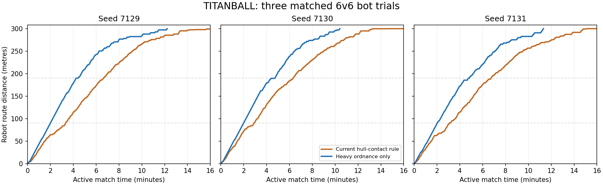

# TITANBALL heavy-ordnance pilot protection experiment

The opt-in filter substantially improves pilot survival and advances the robot faster against the current AI. Three matched 6v6 pairs produced three attacker wins with the filter and three defender wins with the released contact rule. This is an attacker buff in these trials, not evidence that human matches are balanced. The filter remains disabled by default; no build was published or remote server changed.

| Measurement, three matches per policy | Current contact rule | Heavy ordnance only |
|---|---:|---:|
| Mean observed cockpit tenure | 3.73 s | 9.56 s |
| Median observed cockpit tenure | 2.63 s | 3.98 s |
| Pilot deaths per manned minute | 16.08 | 6.22 |
| Pilot health damage per manned second | 36.14 | 14.88 |
| Robot manned share of active round | 39.90% | 56.29% |
| Mean time to 290 metres | 13:04 | 10:15 |
| Attacker wins | 0/3 | 3/3 |

Pilot mortality per manned minute fell by 61%, and mean observed tenure increased 2.56-fold. The smaller median improvement matters: many pilots still die quickly under concentrated explosive or Heavy fire. The filtered matches finished at 12:14, 10:25 and 11:19 of active time; preparation is excluded. One filtered tenure was still ongoing when its match ended, so pooled tenure figures include right-censoring and should not be described as uncensored life expectancy.

## Finish-line sensitivity

The baseline rounds stopped at 299.195, 299.974 and 299.970 metres when their timers expired. Their last pilots had been killed; the robot was unoccupied, rather than permanently blocked with a pilot aboard. Existing completion requires a stopped robot at or beyond 299.98 metres. The second and third runs missed that tolerance by approximately 6 mm and 10 mm. These near-finish losses make win counts sensitive to the current stopping/completion rule. No endpoint, braking or timer change was made for this experiment. The roughly 2:50 improvement in arrival at 290 metres and lower pilot mortality are less dependent on that threshold.

## Tested weapon policy

Only verified hull contacts qualify. Rockets, grenade-launcher impacts, thrown grenade/pipe explosions, Heavy primary fire, engineer sentries and Titan cannons penetrate. Nearby splash remains excluded. Shotguns, sniper/rail, ordinary nails, Medic super nails, flamethrower damage, burning and melee do not reduce pilot health or armour. An explosive napalm charge can still deliver its initial hull-contact explosion through the common explosive path; ongoing fire cannot penetrate.

The Heavy currently shares the Super Nailgun implementation with the Medic. The test classifies the Heavy's primary projectiles at firing time and stores that fact in the projectile definition. Changing the owner to another class before impact does not remove penetration, and a Medic projectile does not gain penetration if its owner becomes Heavy. An arbitrary projectile-extra field cannot override this server-created classification. Weapon damage, rate, ammunition and projectile motion are unchanged.

PIPEBOMB, DETPACK and ASSAULT CANNON names are also explicitly allowed. Current TF thrown grenades and pipe charges are logged as ROCKET LAUNCHER by their common explosion routine. There is no separate playable detpack in the present class implementation, so detpack coverage is a policy check rather than a fabricated live weapon test.

On-foot damage, other modes, permanent 200 cockpit armour, boarding heal, exit lock, pilot ejection, turret damage/range/heat, resupply stations and movement remain unchanged. Administrative suicide still kills/ejects a pilot. The default path avoids the additional hull lookup when the experiment is disabled.

## Validation and reproduction

- 46 focused checks passed, including real projectile contacts, hull versus nearby explosions, grenade/pipe detonations, class changes while projectiles are in flight, and normal on-foot/default behaviour.
- All 25 existing hull-contact regression checks passed across their Quake, UT and Doom fixtures.
- Six full TF/Quake 6v6 simulations completed with 156 integrity checks passing. Seeds: 7129, 7130, 7131. The robot remains stationary during preparation, both teams use their authored high ground, boarding restores class health, and recorded pilot damage requires hull contact.
- Filtered matches rejected 12,756 pellet/projectile damage contacts. These are contact events, not trigger pulls.
- Map, class roster, bots, armour, weapons, turret stats and objective timings were held constant. The seed pairs use current gameplay; navigation/physics scheduling and altered combat outcomes can diverge after the common start.

The six-class team roster is scout, soldier, demoman, medic, heavy and engineer. Sniper/Pyro exclusions are covered by focused checks, not by their presence in the match roster. Bots retain their existing target and weapon selection, including ineffective small-arms fire at the hull. Human defenders could instead target escorts or switch classes. A human playtest and bot awareness of the restriction are needed before treating these results as a balance verdict.

Commands and test-policy details are in [the simulation README](../tools/titanball/simulation/README.md). Use `--pilot-damage heavy` to opt in, and `--pilot-damage contact` for the released baseline. [The validation summary](validation/tb-heavy-ordnance.json) includes per-match results, raw-log hashes and final source hashes. Raw match JSON/logs remain under `test-results/titanball/simulation/`; the final analysis and integrity reports are under `test-results/titanball/`.
