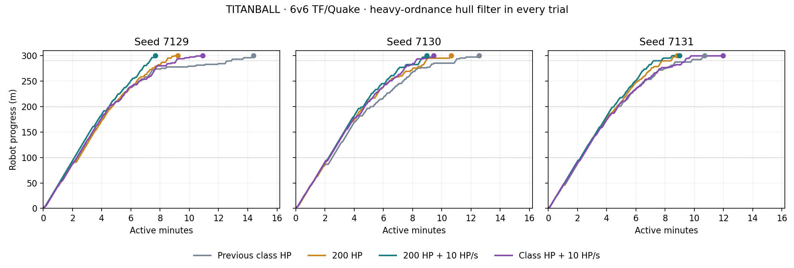

# TITANBALL healing-only trial — 2026-09-14

Tested **10 HP/s cockpit healing with the original TF class health caps**. Boarding still fills the normal class health; a living exit preserves remaining health and restores saved weapons/armour. No 200 HP override or full-health exit restoration is applied in this arm. Heavy naturally retains its existing 200 HP class cap. Medic retains its additive 3 HP/s passive regeneration.

Three new full 6v6 TF/Quake matches use seeds 7129, 7130 and 7131 on Ashfall, with the heavy-ordnance hull filter enabled. The nine prior control matches are reused after confirming all eight recorded production/runner source hashes match. Every arm shares the same map, six stations, bot rosters, armour, turrets, timers and navigation code.

| Metric | Class HP, no healing | Class HP + 10 HP/s | 200 HP, no healing | 200 HP + 10 HP/s |
|---|---:|---:|---:|---:|
| Attacker wins | 3/3 | 3/3 | 3/3 | 3/3 |
| Mean active round time | 12:33 | 10:47 | 9:34 | 8:33 |
| Mean time to 290 m | 11:13 | 8:54 | 8:35 | 7:52 |
| Mean observed pilot tenure | 9.71 s | 10.68 s | 11.55 s | 17.29 s |
| Median observed pilot tenure | 4.32 s | 3.93 s | 4.70 s | 6.30 s |
| Pilot deaths per manned minute | 6.08 | 5.56 | 5.09 | 3.36 |
| Manned share of active time | 50.7% | 58.9% | 66.4% | 74.2% |
| Mean cannon kills per match | 37.0 | 39.3 | 35.3 | 36.0 |

Compared with class HP without healing, the healing-only arm changed mean observed tenure by **+10.0%**, pilot deaths per manned minute by **-8.4%**, and mean active round time by **-105.9 seconds**.

Healing alone provided a modest, uneven survival improvement in this sample: median tenure fell from 4.32 to 3.93 seconds despite the higher mean. Two deliveries were faster and one slower than the no-healing controls. All arms won every match, so these results do not establish a change in win probability. The much larger mean tenure with 200 HP plus healing was not reproduced by healing alone.

Cockpit regeneration restored **3,869 HP** across the healing-only trials, averaging **3.39 HP per active manned second** after class caps and full-health time. This count excludes Medic passive healing and the health refill on boarding.

| Seed | Class HP, no healing | Class HP + healing | Healing-only result |
|---|---:|---:|---|
| 7129 | 14:23 | 10:55 | Attackers win |
| 7130 | 12:33 | 9:27 | Attackers win |
| 7131 | 10:42 | 11:58 | Attackers win |

## Validation and limits

All **56 focused class-health healing checks** and **136 match-integrity checks** passed. Checks cover all nine class caps, original exit health, actual dispenser rate, frame-rate independence, Medic regeneration, no stored healing at full health, boarding lock, death and stale-life cleanup. Completed logs contain no script or engine errors; the existing exit-time ObjectDB warning remains.

This is a small bot-only sample, not a human balance certification. Observed tenures include voluntary exits and surviving round-end pilots. Matched seeds do not force identical later combat or asynchronous physics trajectories. Round times exclude the 60-second preparation; the 290 m timing helps separate route progress from the existing stopped-robot delivery tolerance. The 200 HP comparison arms also restore full class health on living exit, so their differences are not solely a health-cap effect.

Normal game defaults remain unchanged: fixed 200 HP cockpit, regeneration off. Healing-only is available through the simulation runner; it has not been published, deployed, or headset-tested. [Reproduction commands](../tools/titanball/simulation/README.md#cockpit-health-and-regeneration-trial), [full results and hashes](validation/tb-pilot-healing-only.json). Raw new telemetry is in `test-results/titanball/simulation/pilot-heal-only-tf-*.json`.
