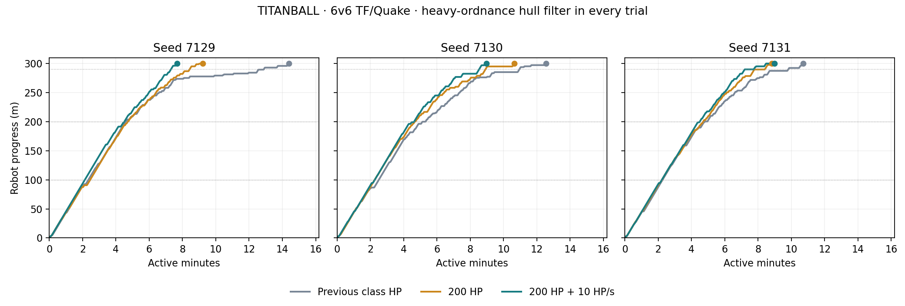

# TITANBALL cockpit health and healing trial — 2026-09-14

TB pilots now board with **200 HP and a 200 HP maximum**, irrespective of TF class. A living exit restores full class health, the class health maximum, and the previously saved weapon/armour. Death ejects without reviving the pilot; stale cockpit cleanup cannot heal a replacement life. The three-second exit lock remains.

Gradual cockpit regeneration is an **opt-in experiment**: **10 HP/s**, capped at 200. This matches the TB resupply dispenser's nominal rate: its existing health routine supplies 20 × 0.5 HP on a one-second cooldown. The cockpit uses fractional credit to provide steady healing independent of physics rate. It restores neither ammunition nor armour, accumulates no credit at full health, and stops on exit/death. Medic's existing 3 HP/s remains additive. Shared constants preserve the station's existing cadence and supply quantities; ordinary station polling can quantize its one-second cooldown.

## Matched 6v6 results

Nine full TF/Quake matches used seeds 7129, 7130 and 7131, with the heavy-ordnance hull filter enabled in every arm. Each team had scout, soldier, demoman, medic, heavy and engineer. Both new-health arms also restore full class health on living exit; the previous arm uses the original class-based cockpit health and exit behavior. Therefore the middle column separates the effect of the 200 HP/exit rules from gradual healing.

| Metric | Previous rules | 200 HP, no regeneration | 200 HP + 10 HP/s |
|---|---:|---:|---:|
| Attacker wins | 3/3 | 3/3 | 3/3 |
| Mean active round time | 12:33 | 9:34 | 8:33 |
| Mean time to 290 m | 11:13 | 8:35 | 7:52 |
| Mean observed pilot tenure | 9.71 s | 11.55 s | 17.29 s |
| Median observed pilot tenure | 4.32 s | 4.70 s | 6.30 s |
| Pilot deaths per manned minute | 6.08 | 5.09 | 3.36 |
| Manned share of active time | 50.7% | 66.4% | 74.2% |
| Mean cannon kills per match | 37.0 | 35.3 | 36.0 |

Compared with the 200 HP-only arm, healing increased mean observed cockpit tenure by **50%** and median tenure by **34%**, and reduced pilot deaths per manned minute by **34%**. Across the healing runs it restored **4,878 HP**, averaging **4.27 HP per active piloted second**; time at full health accounts for much of the difference from the nominal 10 HP/s rate.

Healing shortened delivery in seeds 7129 and 7130 by 92.7 and 100.8 seconds respectively; seed 7131 finished 9.6 seconds later with healing. All three arms won all three matches, so the result demonstrates changes in survival and pace, not a measured increase in win probability.

## Interpretation and limits

This is an attacker survivability buff in the tested bot matches. Compare route times and pilot mortality as well as wins: the sample is small, and human teams could change class composition or concentrate fire differently. Mean/median tenures include voluntary exits and pilots still alive when a round ended, so they are observed cockpit occupancy durations, not uncensored life-expectancy estimates. Incoming damage per piloted second also changes with routes and exposure; it is not a controlled damage-reduction coefficient.

Preparation time is excluded from active durations. The existing two checkpoint extensions, 300 m route, stopped-robot finish tolerance, armour, turrets, station layout and bot policies were held constant. Arrival at 290 m is included because final-delivery timing is sensitive to the last few metres and pilot handoffs. All arms used a corrected navigation-readiness probe: Ashfall retains unused vertices outside its usable mesh, so readiness now samples an actual polygon interior. All controls were rerun on the same current code. Identical seeds do not guarantee identical subsequent physics/navigation scheduling or combat trajectories.

## Validation and status

- **56 focused health/healing checks** passed, including the actual dispenser branch, all nine class caps and exit health values, 60/90/120 Hz and coarse healing steps, Medic regeneration, fractional credit, full-health capping, death and stale-life cleanup.
- Existing regressions passed: pilot (40), ladder (28), heavy ordnance (46), navigation (5), server bots (21).
- **103 match-integrity checks** passed across all nine completed runs: roster, preparation, six stations, boarding health/lock, permitted hull-contact damage, healing caps/rate and matched conditions.
- Completed match logs contain no script or engine errors. The existing Godot exit-time ObjectDB warning remains.

The 200 HP boarding/exit rules are implemented in game code. Regeneration remains off by default and is enabled by the simulation runner's `--pilot-healing station`; it has not been published, deployed remotely, or tested in a live headset session. [Reproduction commands](../tools/titanball/simulation/README.md#cockpit-health-and-regeneration-trial) and [machine-readable results/source hashes](validation/tb-pilot-healing.json). Raw logs and match telemetry are under `test-results/titanball/simulation/`.
