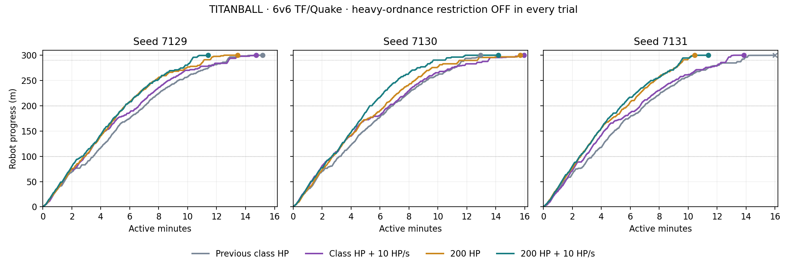

# TITANBALL health and healing with unrestricted hull weapons — 2026-09-14

Twelve fresh full 6v6 TF/Quake bot matches on Ashfall tested all four health/healing options with the heavy-ordnance restriction **disabled**. Seeds 7129, 7130 and 7131 were used for every arm. Nearby splash remains excluded: damage still requires a direct hull impact or an explosion on its surface. All matches ran locally headless; no remote deployment or headset test was performed.

Class-health arms use the original class cap and preserve remaining health on living exit. The fixed-health arms give 200 HP on boarding and restore full normal class health on living exit. Every arm retains the full boarding heal, three-second exit lock, permanent cockpit armour, same turrets, map, stations, timings, bots and navigation. Healing supplies 10 HP/s up to the selected cap; Medic passive regeneration remains additive.

## Results

| Metric | Class HP, no healing | Class HP + 10 HP/s | 200 HP, no healing | 200 HP + 10 HP/s |
|---|---:|---:|---:|---:|
| Attacker wins | 2/3 | 3/3 | 3/3 | 3/3 |
| Mean active round duration¹ | 14:42 | 14:50 | 13:11 | 12:19 |
| Mean winning delivery time | 14:04 | 14:50 | 13:11 | 12:19 |
| Mean time to 290 m² | 12:45 | 13:00 | 11:11 | 9:50 |
| Mean observed pilot tenure | 3.77 s | 4.32 s | 5.17 s | 6.29 s |
| Median observed pilot tenure | 2.50 s | 2.46 s | 3.37 s | 3.70 s |
| Pilot deaths per manned minute | 15.91 | 13.88 | 11.61 | 9.55 |
| Pilot deaths within 3 s of boarding³ | 59.5% | 65.4% | 41.2% | 34.8% |
| Manned share of active time | 43.6% | 43.1% | 48.1% | 51.3% |
| Mean cannon kills per match | 45.7 | 40.3 | 46.3 | 38.0 |
| Cockpit healing per manned second | 0.00 HP | 7.67 HP | 0.00 HP | 8.21 HP |

¹ Includes defender timeout victories; duration is not always successful delivery time. Preparation is excluded. ² Arrival means include only runs reaching the landmark. ³ Pilot deaths during active play within three seconds of the actual boarding time; not an independent randomized estimate of the exit lock’s effect.

| Seed | Class HP, no healing | Class HP + healing | 200 HP, no healing | 200 HP + healing |
|---|---|---|---|---|
| 7129 | Attackers · 15:10 · 299.983 m | Attackers · 14:43 · 300.000 m | Attackers · 13:27 · 300.000 m | Attackers · 11:24 · 300.000 m |
| 7130 | Attackers · 12:57 · 300.000 m | Attackers · 15:56 · 300.000 m | Attackers · 15:41 · 300.000 m | Attackers · 14:11 · 299.995 m |
| 7131 | Defenders · 16:00 · 299.816 m | Attackers · 13:51 · 300.000 m | Attackers · 10:26 · 300.000 m | Attackers · 11:23 · 299.990 m |

## Progression and damage

| Metric | Class HP, no healing | Class HP + healing | 200 HP, no healing | 200 HP + healing |
|---|---:|---:|---:|---:|
| Mean arrival at 100 m | 3:23 (3/3) | 2:51 (3/3) | 2:45 (3/3) | 2:39 (3/3) |
| Mean arrival at 200 m | 6:59 (3/3) | 6:39 (3/3) | 5:57 (3/3) | 5:28 (3/3) |
| Mean arrival at 290 m | 12:45 (3/3) | 13:00 (3/3) | 11:11 (3/3) | 9:50 (3/3) |
| Mean time from 290 m to round end | 1:57 | 1:50 | 2:00 | 2:29 |
| Pilot HP damage from weapons blocked by heavy rule | 63.8% | 63.9% | 60.2% | 60.1% |

The final-approach duration can end in timeout rather than delivery. Wins remain sensitive to the existing stopped-robot finish tolerance; report the precise endpoint and 290 m arrival alongside the winner. Damage classification follows the tested heavy allowlist, including Heavy primary fire; the ordinary-weapon column includes Medic super nails.

## Reassessment for human play

**200 HP with 10 HP/s healing remains the preferred human-playtest candidate when the heavy-ordnance restriction is disabled.** This is a recommendation about progression and pilot usability, not a demonstrated 50/50 team balance. Eleven of twelve trials were attacker wins; the sole defender victory stopped only 18.4 cm short of the endpoint. That does not establish the class-health baseline as the fairest option.

Compared with 200 HP alone, adding healing increased mean observed tenure by **21.7%**, reduced pilot deaths per manned minute by **17.8%**, and shortened mean delivery by **51.9 seconds**. Healing delivered faster in two seeds but 56.8 seconds slower in the third. The median increase was modest: **3.37 to 3.70 seconds**. The preferred option therefore improves resilience without providing long uninterrupted cockpit sessions in these trials.

Its first 200 metres averaged **5:28**, followed by **6:51 for the final 100 metres**. That retains the intended harder defensive finish while allowing earlier progress. However, the last 10 metres alone averaged **2:29**, longer than the 200 HP-only arm's **2:00**. Healing improved earlier survival/progression; it did not reliably remove final-delivery stalls.

The human-tactics interpretation is conditional. Uniform 200 HP reduces class-dependent fragility; attackers who clear firing positions could exploit healing during the resulting lull. Coordinated defenders could counter with overlapping firing lanes and concentrated impacts. Weapons excluded by the heavy rule accounted for roughly **60–64% of pilot HP damage** here, so ordinary weapons are a substantial threat with the rule off. Human class selection and coordinated escort/defense could strengthen either side, and the bot runs cannot predict the net effect.

Class-health healing is the least compelling compromise: it improved mean tenure but left a **2.46-second median**, **65.4% of pilot deaths within three seconds of boarding**, and no average pacing improvement over the class-health baseline. The natural 200 HP Heavy cap also leaves an incentive to favor Heavy pilots. The fixed-200 options offer a more consistent health buffer across classes.

Even the recommended option still had **34.8% of pilot deaths within the exit lock** and a **3.70-second median tenure**. It is the strongest of these four candidates for a coordinated human test, but none has yet demonstrated satisfactory human pilot longevity or team balance. No additional balance values or finish behavior were changed during this experiment.

## Validation and limits

All **136 match-integrity checks** passed: completed rounds, 6v6 class rosters, preparation immobility, six stations, correct boarding HP/exit lock, hull-contact damage, actual ordinary-weapon penetration with no heavy-policy rejection events, healing caps/rate and complete matched groups on the same map. Logs contain no script or engine errors. Existing Godot exit-time ObjectDB warnings remain.

All eight recorded production/runner source hashes match the prior healing experiments. No production change was needed. Previously passing health/healing lifecycle checks remain applicable; those fixtures use the default unrestricted contact policy. The analyzer was extended for that policy and checked against the previous four-arm statistics.

Three seeds per option are exploratory. These bots do not adapt class composition, coordinate volleys or organize human pilot handoffs. Observed tenures include living exits and surviving pilots at round end. Shared seeds do not guarantee identical later combat or physics/navigation scheduling. The fixed-200 arms also change living-exit healing, so they do not isolate the cap alone. Incoming damage rates depend on exposure and progression as well as the health policy.

[Machine-readable results and hashes](validation/tb-pilot-unrestricted.json). [Reproduction instructions](../tools/titanball/simulation/README.md#health-comparison-without-the-heavy-ordnance-restriction). New raw logs and telemetry use `test-results/titanball/simulation/pilot-unrestricted-*-tf-*.json`. Server defaults and release builds are unchanged.
