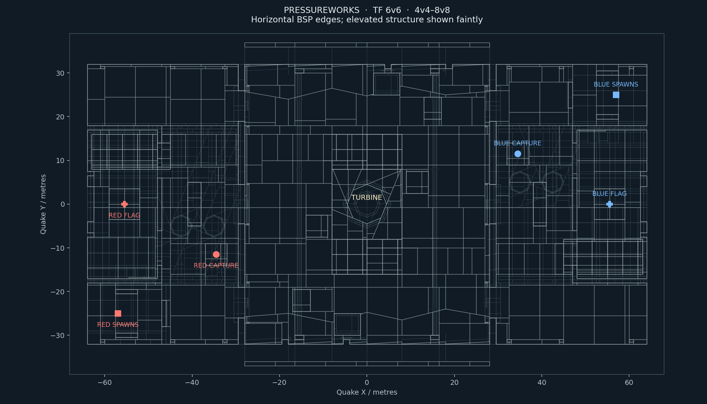

**Pressureworks — experimental TF map for FPSloppa**

Designed for **6v6**, usable from **4v4 to 8v8**. Weathered brick pump stations flank a cobbled turbine yard, with copper pipework, timber ceilings, gravel paths and grass beneath a rocky escarpment. Upper ramps, lower maintenance lanes, screened spawn exits and separate flag/capture rooms form the playable layout.

In the project, choose **Assets → Rescan**, select **Pressureworks | TF 6v6**, and host **TF**. The map ID is `tf_pressureworks`. It is appended to the project's TF maplist.

For another FPSloppa installation, extract the package's `maps/` contents into the external `maps/` folder. Keep the `Pressureworks/` notices and `navigation/tf_pressureworks.res`. Add `tf_pressureworks` to your existing `tf_maplist.txt`; the package deliberately supplies an example inside this folder rather than replacing your rotation.

Server console example:

```text
set sv_gametype "tf"
map tf_pressureworks
```

Steal the flag from the enemy vault and return it to your own pump-hall capture ring. Your service room provides resupply. All three base entrances are walkable without jumping, including by Heavy. The original 18 m Engineer sentry range is sufficient for the tested defensive positions and remains unchanged.

This is a first playable map, tested with automated objectives, physical traversal and bot skirmishes. Human competitive balance remains to be established. It requires FPSloppa's TF rules and is not advertised as compatible with original Quake TF entities.

The editable Quake source is `tf_pressureworks.map`, with `pressureworks.wad` alongside it. Both can be opened in a Quake brush editor. Rebuild from the FPSloppa project root:

```sh
python3 tools/pressureworks/build.py --compiler /path/to/ericw-tools/bin
godot --headless --path . --script res://tools/pressureworks/bake.gd
python3 tools/pressureworks/validate.py
python3 tools/pressureworks/package.py
```

The builder uses ericw-tools v0.18, full VIS and embedded RGB lightmaps. The included editor WAD can reproduce this texture selection without downloading the complete source archives. Selecting additional textures requires the original archives from the FPSloppa Makkon tooling and `--librequake-archive /path/to/librequake-dev.zip`. Original texture records stay unchanged; brush UV scales determine their size in the map. The builder invalidates this map's navigation cache; always rebake after editing geometry. Validation runs physical traversal once and isolated 4v4, 6v6, swapped 6v6 and 8v8 skirmishes at normal 60 Hz physics timing. The package script refuses stale or failed acceptance results. `manifest.json`, `navigation-sha256.txt` and `validation.json` identify the tested build.

Original geometry and new tool code are dedicated under [CC0 1.0](CC0-1.0.txt). **Textures have separate licences.** Makkon Industrial/Metal by Ben “Makkon” Hale is used under the existing project permission; retain `Makkon_License.txt`. LibreQuake ground, rock, stone, light and sky textures use BSD-3-Clause; retain its copying and credits files. `texture-sources.json` lists each original, unchanged texture record and source hash. This package does not grant broader rights to the Makkon art.

See [STYLE.md](STYLE.md) for material placement and interior previews, and [RESEARCH.md](RESEARCH.md) for the sources, design rationale and evidence limits.



