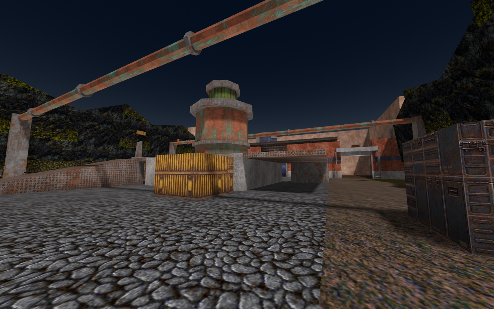
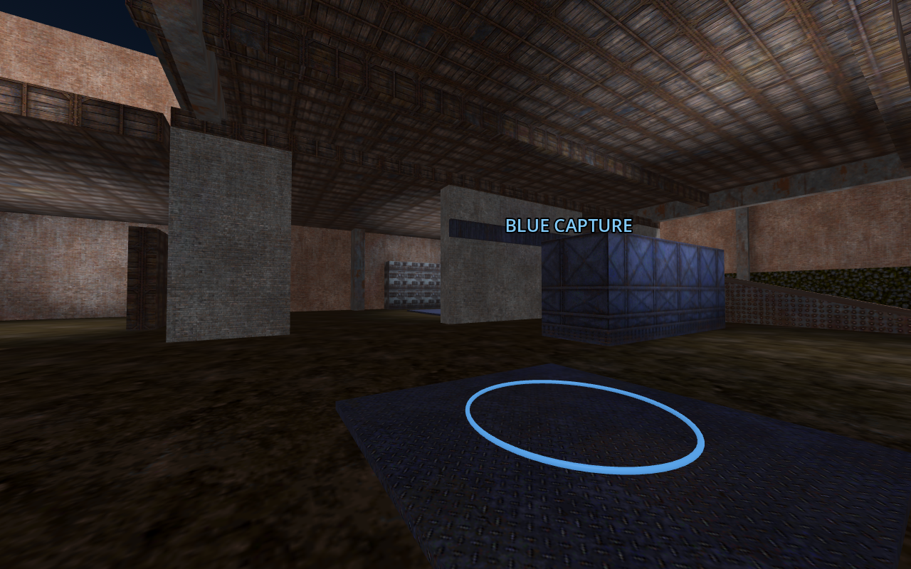
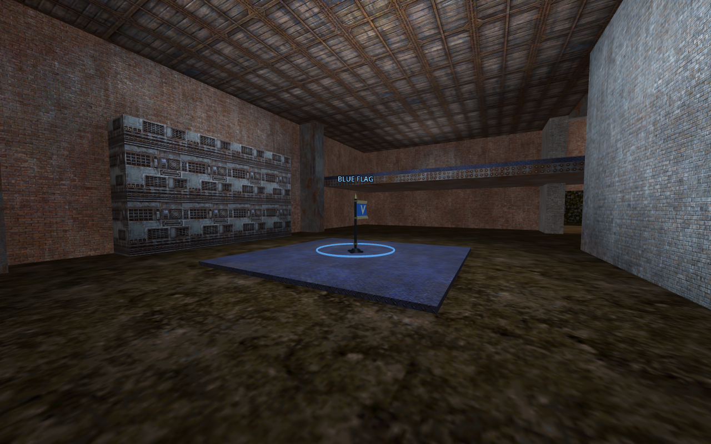

Pressureworks visual revision — 12 September 2026

The setting is an old pumping station built into a quarry. Masonry carries the buildings, timber supports their roofs, and exposed copper and steel identify the machinery. Team paint marks entrances, equipment and objectives. The outdoor yard uses cobbles, gravel and grass, with uneven rock above retaining walls.

| Material family | Placement |
| --- | --- |
| Makkon brown, red and grey brick | Walls, doorway lintels, foundations and vault partitions |
| Makkon timber | Ceiling boards, crossbeams and wooden storage crates |
| Makkon copper and iron | Turbine, round overhead pipes, collars and structural metal |
| Makkon painted panels, ducts and vents | Team markings and pump equipment |
| LibreQuake cobbles and worn stone | Yard paving and interior floors |
| LibreQuake gravel, grass and mossy stone | Irregular yard margins and retaining walls |
| LibreQuake rock | Faceted quarry backdrop with varying ridge heights |
| LibreQuake light panels | Doorway fixtures |

This revision uses 30 original textures: 21 Makkon and nine LibreQuake, including the sky texture. Brush UV scales adjust their apparent size; original pixel records and all four mip levels are preserved. `texture-audit.json` verifies the compiled BSP against the original records identified in `texture-sources.json`.

Ground material boundaries stay flush. The quarry scenery sits beyond or above the edge retaining walls, and pipes remain overhead. The central obstacle, three base entrances, ramps, screened spawns and objective positions retain the gameplay layout. The red and blue halves share geometry and material placement under a 180-degree rotation, with team colour variations.

