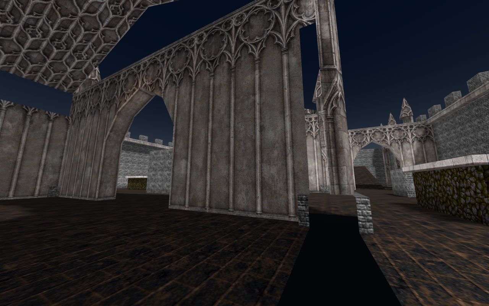
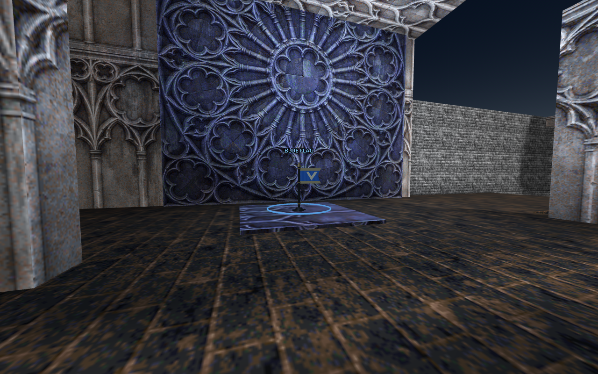
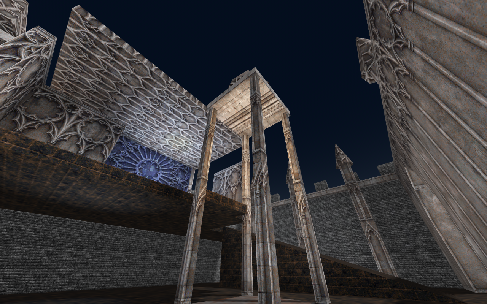
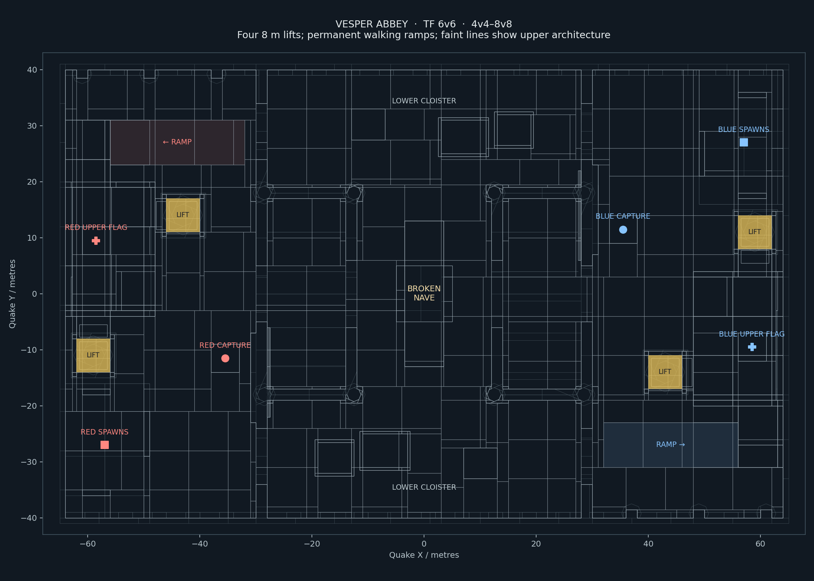

**Vesper Abbey — experimental TF map for FPSloppa**

An original gothic map for **6v6**, usable from **4v4 to 8v8**. A ruined central nave separates two fortified sanctuaries. Pointed arches, carved stone, rose windows, bell towers and crenellated walls use original Makkon Gothic Stone textures, with metal and LibreQuake stone accents.

Each base has **two working elevators**. Step onto a steel deck to rise eight metres in two seconds; it waits three seconds upstairs and returns automatically. Approaching the fixed upper landing also calls the lift. A wide ramp supplies a permanent walking route to each sanctuary, so access never depends on waiting for an elevator. The four lifts use the trigger-operated vertical-door technique found in well6.

Steal the enemy flag from the upper sanctuary and bring it to your downstairs capture altar. Rear chapterhouses provide screened spawn exits and resupply. Eight spawns per team support the largest intended match size. The broken nave and offset tomb cover interrupt direct sightlines; the lower cloisters offer alternate approaches.

In FPSloppa, choose **Assets → Rescan**, select **Vesper Abbey | TF 6v6**, and host **TF**. Map ID: `tf_vesper`.

For another FPSloppa installation, extract the ZIP's `maps/` contents into its external `maps/` folder. Keep `VesperAbbey/` notices and `navigation/tf_vesper.res`. Add `tf_vesper` to your existing `tf_maplist.txt`; the archive supplies an example rather than overwriting your rotation.

```text
set sv_gametype "tf"
map tf_vesper
```

This map uses FPSloppa's native TF objective entities. Original Quake TF compatibility has not been established. Automated traversal, elevator tests and bot skirmishes provide a playable starting point; human competitive balance remains experimental. The game's 18 m sentry range remains unchanged.

The editable source is `tf_vesper.map`, with `vesper.wad` beside it. Rebuild from the FPSloppa source root:

```sh
python3 tools/vesper/build.py --compiler /path/to/ericw-tools/bin
godot --headless --xr-mode off --path . --script res://tools/vesper/bake.gd
python3 tools/vesper/validate.py
python3 tools/vesper/package.py
```

The builder uses ericw-tools v0.18, full VIS and embedded RGB lightmaps. Decorative stonework uses `func_detail`, preserving collision while keeping visibility compilation practical. The supplied editor WAD reproduces this material selection without the complete source archives. Changing the selection requires the original archives named in `texture-sources.json`. The Gothic Stone archive is pinned by SHA-256 in the builder. Compilation invalidates this map's navigation cache; always rebake afterward.

Validation checks objectives, capsule clearance, physical Heavy traversal, turret range/occlusion, four complete lift rides, exits onto fixed upper landings, upper calls and late-join elevator state. Separate normal-60-Hz matches exercise 4v4, 6v6, swapped 6v6 and 8v8. Packaging rejects stale BSP/source/navigation/code fingerprints and failed acceptance.

Original geometry and new tool code are **CC0 1.0**. Texture artwork has separate licences: Makkon Gothic Stone and Metal by **Ben “Makkon” Hale** use the existing FPSloppa project permission, and LibreQuake textures use BSD-3-Clause. Keep the supplied licence and credit notices. Original indexed texture records, dimensions, names and all four mip levels remain unchanged; only brush UV placement and scale vary. `texture-sources.json` records provenance and `texture-audit.json` verifies the compiled artwork.

See [RESEARCH.md](RESEARCH.md) for the well6 reference, design decisions and measured validation results.








