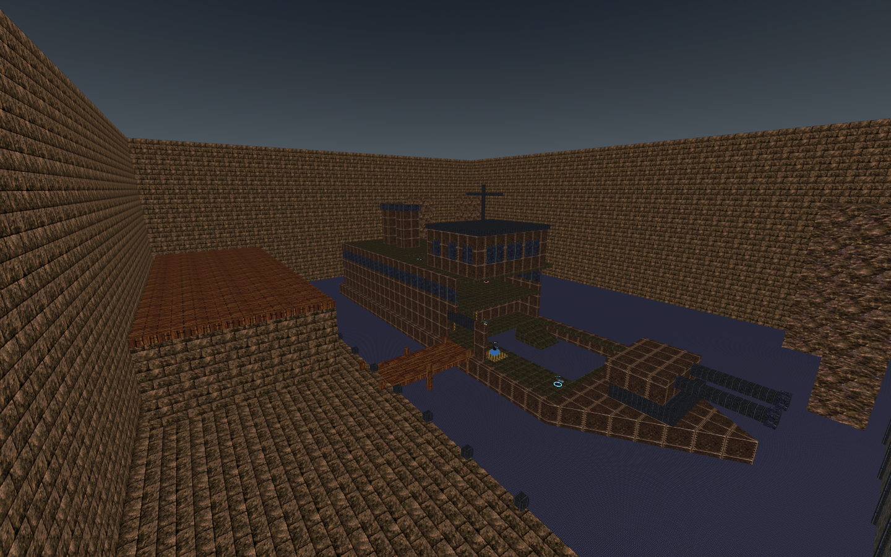

# Frigate Assault adaptation

`as_frigate` is an independently authored BSP29 interpretation of the UT99
AS-Frigate scenario. Like HiSlop, it uses reference research, original convex
brush construction, embedded LibreQuake mipmaps, ericw-tools compilation, Godot
scene/navigation baking, collision traversal tests and rendered inspection.
It is a playable adaptation, not an exact reconstruction of the retail map.



## Reference and provenance

[The Liandri Archives, preserved by Unreal Archive](https://unrealarchive.org/wikis/the-liandri-archives/AS-Frigate.html)
identifies Shane Caudle's original and documents the cargo warehouse, exposed
gangway, submerged entrance, aft compressor and upper gun control objective.
The three original screenshots on that page informed the pointed bow, paired
barrels, stacked superstructure, machinery and bridge console. Reference images
were inspected separately; they are not build inputs or distributed assets.

No Unreal packages, retail geometry, extracted textures, music or models are
used. Geometry and generator additions are offered under CC0-1.0. Embedded art
comes from the project's licensed LibreQuake assets (`as_hislop.bsp`, `lqdm1.bsp`,
`lqdm3.bsp`, and the LibreQuake-only WAD under `tools/fortressone/`). No converted
FortressOne map geometry is used. Source hashes and notices are under
`maps/Frigate/`.

## Build and play

Install the project's normal base maps first. Use
[ericw-tools 0.18](https://github.com/ericwa/ericw-tools/releases/tag/v0.18):

```sh
python3 tools/frigate_concept/build.py --compiler-dir /path/to/ericw-tools/bin --install
godot --headless --xr-mode off --path . --script res://tools/frigate_concept/bake_base.gd
godot --xr-mode off --path . -- --import-map maps/as_frigate.bsp --practice --mode as
```

The compiler writes editable MAP, subset WAD, BSP, provenance and logs to
`test-results/frigate/build/`. `--fast-vis` is for iteration; omit it for
distribution. `--install` copies the BSP/notices and updates the local catalog.
Always rebake after installing changed geometry. `build_base_assets.py` includes
the BSP, both scene caches, navigation and notices in the next base package.
This work does not replace an already published asset package.

Select **Host → Assault → Frigate** in the source build. For a dedicated server,
use `maps/Frigate/frigate.cfg`, or add `as_frigate` to its `as_maplist`. Six minutes
and 4–8 players are initial playtest settings. Use matching updated clients and
server for the destructible objective; old builds only understand touch
objectives. AS has no TF classes or engineer abilities.

## Adaptation choices

The warehouse/canteen opens onto a wide quay. Cross the gangway under sentry
fire, or dive below the starboard intake lintel, swim into the flooded forward
compartment and follow the ramp to the main deck. The quay's eastern escape
ramp provides a way back from the harbor. Blue lamps mark the intake; warm
lighting marks the internal machinery route.

Lower compartments lead aft to a **240 HP compressor**. Only live attackers can
damage the current objective, using normal hitscan, projectiles or melee. Its
health label and destruction effect provide feedback. Touching it or pressing
Use cannot skip destruction. The bridge stays physically sealed until the
compressor is destroyed, even with friendly fire enabled.

Two stairways reach the mess deck; the final flight enters the bridge through
the unlocked door. Press the gun console with a VR hand motion or Use; desktop
players retain proximity activation. Naval gun/harbor explosion effects accompany
completion. Paired-leg timing swaps roles and restores the compressor, sentry
and door. One forward checkpoint sits outside the locked bridge.

Dimensions, stairs, water exits, weapons and defensive placement are adapted to
FPSloppa. The original's weapon-jump shortcuts are not required routes here.
The ship and harbor gate remain stationary during the end-of-leg effects.

## Validation

```sh
godot --headless --xr-mode off --path . --script res://deathmatch/tests/frigate.gd
python3 tools/frigate_concept/test_network.py
godot --xr-mode off --path . --script res://deathmatch/tests/frigate.gd -- --views
```

Results and six rendered viewpoints go to `test-results/frigate/`. Traversal
moves the real player capsule between waypoints rather than teleporting between
rooms. Tests also cover water escape, spawn clearance, objective guards, pistol
damage, role reset and lobby cleanup. The ENet test uses a real dedicated server
and remote client for health, destruction, door state, remote Use and return-leg
replication. Human multiplayer balance, headset comfort and autonomous bot
completion of a contested match still need playtesting.

The final full-VIS BSP is 1,579,344 bytes, with 246 brushes, 73 entities and
13 texture names; the navigation mesh contains 698 polygons. Validation on
2026-09-11 passed **28 map/gameplay checks, 15 ENet checks and 73 existing HiSlop
Assault checks**. See `docs/validation/frigate.json`. Six desktop views were
inspected. This map has not yet received wearer-confirmed VR traversal or a
human multiplayer balance test. Godot reports the existing one-instance
ObjectDB exit warning in headless tests (two in graphical runs).
